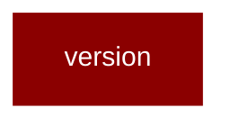

# version

<Badge color="purple">Wrapper</Badge>

## Overview


```mermaid
graph TD
    Module["version"]:::agent
    classDef agent fill:#8B0000,stroke:#8B0000,color:#fff
```

## Import

```python
from praisonai import version
```
