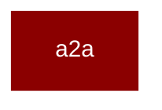

# a2a

<Badge color="blue">Core SDK</Badge>

## Overview



A2A Protocol Integration for PraisonAI Agents

This module provides A2A (Agent2Agent) protocol support,
enabling PraisonAI Agents to be exposed as A2A Servers
for agent-to-agent communication.

Usage:
    from praisonaiagents import Agent
    from praisonaiagents.ui.a2a import A2A
    from fastapi import FastAPI

    agent = Agent(name="Assistant", role="Helper", goal="Help users")
    a2a = A2A(agent=agent)

    app = FastAPI()
    app.include_router(a2a.get_router())
    
    # Agent Card available at: GET /.well-known/agent.json
    # A2A endpoint at: POST /a2a (JSON-RPC)

## Import

```python
from praisonaiagents import a2a
```
