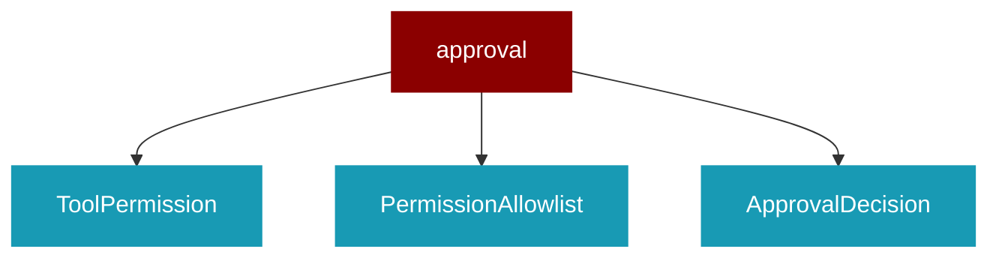

# approval

<Badge color="blue">Core SDK</Badge>

## Overview



Human Approval Framework for PraisonAI Agents

This module provides a minimal human-in-the-loop approval system for dangerous tool operations.
It extends the existing callback system to require human approval before executing high-risk tools.

## Import

```python
from praisonaiagents import approval
```

## Classes

<AccordionGroup>
### ToolPermission

Permission entry for a tool.

<Expandable title="Properties">

<ResponseField name="tool_name" type="str">
</ResponseField>
<ResponseField name="allowed_paths" type="List">
</ResponseField>
<ResponseField name="session_only" type="bool">
</ResponseField>

</Expandable>

### PermissionAllowlist

Persistent permission allowlist for tools.

Allows pre-approving tools and paths to skip interactive approval.
Can be saved/loaded from JSON for persistence across sessions.

Usage:
    allowlist = PermissionAllowlist()
    allowlist.add_tool("read_file")
    allowlist.add_tool("write_file", paths=["./src", "./tests"])
    
    if allowlist.is_allowed("read_file"):
        # Skip approval prompt
        pass

<AccordionGroup>
<Accordion title="add_tool(tool_name: str, paths: Optional) -> None">
  Add a tool to the allowlist.

Args:
    tool_name: Name of the tool to allow
    paths: Optional list of allowed paths (empty = all paths)
    session_only: If True, permission expires with session
</Accordion>
<Accordion title="remove_tool(tool_name: str) -> bool">
  Remove a tool from the allowlist.
</Accordion>
<Accordion title="is_allowed(tool_name: str, path: Optional) -> bool">
  Check if a tool is allowed.

Args:
    tool_name: Name of the tool
    path: Optional path to check against allowed paths
    
Returns:
    True if tool is allowed (optionally for the given path)
</Accordion>
<Accordion title="is_empty() -> bool">
  Check if allowlist is empty.
</Accordion>
<Accordion title="list_tools() -> List">
  List all allowed tools.
</Accordion>
<Accordion title="clear_session_permissions() -> None">
  Clear session-only permissions.
</Accordion>
<Accordion title="save(filepath: str) -> None">
  Save allowlist to JSON file.
</Accordion>
</AccordionGroup>

### ApprovalDecision

Result of an approval request

<Expandable title="Constructor Parameters">

<ParamField query="approved" type="bool">
   (Required)
</ParamField>
<ParamField query="modified_args" type="Optional">
   (default: `None`)
</ParamField>
<ParamField query="reason" type="str">
   (default: `''`)
</ParamField>

</Expandable>

</AccordionGroup>

## Functions

<AccordionGroup>
### get_permission_allowlist()

Get the global permission allowlist.

```python
def get_permission_allowlist() -> PermissionAllowlist
```

### set_permission_allowlist()

Set the global permission allowlist.

```python
def set_permission_allowlist(allowlist: PermissionAllowlist) -> None
```

<Expandable title="Parameters">

<ParamField query="allowlist" type="PermissionAllowlist">
</ParamField>

</Expandable>

### set_approval_callback()

Set a custom approval callback function.

The callback should accept (function_name, arguments, risk_level) and return ApprovalDecision.

```python
def set_approval_callback(callback_fn: Callable) -> Any
```

<Expandable title="Parameters">

<ParamField query="callback_fn" type="Callable">
</ParamField>

</Expandable>

### get_approval_callback()

Get the current approval callback function.

Returns the custom callback if set, otherwise None.
This should be used instead of directly accessing approval_callback
to ensure the latest callback is always used.

```python
def get_approval_callback() -> Optional
```

### mark_approved()

Mark a tool as approved in the current context.

```python
def mark_approved(tool_name: str) -> Any
```

<Expandable title="Parameters">

<ParamField query="tool_name" type="str">
</ParamField>

</Expandable>

### is_already_approved()

Check if a tool is already approved in the current context.

```python
def is_already_approved(tool_name: str) -> bool
```

<Expandable title="Parameters">

<ParamField query="tool_name" type="str">
</ParamField>

</Expandable>

### clear_approval_context()

Clear the approval context.

```python
def clear_approval_context() -> Any
```

### require_approval()

Decorator to mark a tool as requiring human approval.

Args:
    risk_level: The risk level of the tool ("critical", "high", "medium", "low")

```python
def require_approval(risk_level: RiskLevel) -> Any
```

<Expandable title="Parameters">

<ParamField query="risk_level" type="RiskLevel">
</ParamField>

</Expandable>

### console_approval_callback()

Default console-based approval callback.

Displays tool information and prompts user for approval via console.

```python
def console_approval_callback(function_name: str, arguments: Dict) -> ApprovalDecision
```

<Expandable title="Parameters">

<ParamField query="function_name" type="str">
</ParamField>
<ParamField query="arguments" type="Dict">
</ParamField>
<ParamField query="risk_level" type="str">
</ParamField>

</Expandable>

### request_approval()

Request approval for a tool execution.

Args:
    function_name: Name of the function to execute
    arguments: Arguments to pass to the function
    
Returns:
    ApprovalDecision with approval status and any modifications

```python
async def request_approval(function_name: str, arguments: Dict) -> ApprovalDecision
```

<Expandable title="Parameters">

<ParamField query="function_name" type="str">
</ParamField>
<ParamField query="arguments" type="Dict">
</ParamField>

</Expandable>

### configure_default_approvals()

Configure default dangerous tools to require approval.

```python
def configure_default_approvals() -> Any
```

### add_approval_requirement()

Dynamically add approval requirement for a tool.

```python
def add_approval_requirement(tool_name: str, risk_level: RiskLevel) -> Any
```

<Expandable title="Parameters">

<ParamField query="tool_name" type="str">
</ParamField>
<ParamField query="risk_level" type="RiskLevel">
</ParamField>

</Expandable>

### remove_approval_requirement()

Remove approval requirement for a tool.

```python
def remove_approval_requirement(tool_name: str) -> Any
```

<Expandable title="Parameters">

<ParamField query="tool_name" type="str">
</ParamField>

</Expandable>

### is_approval_required()

Check if a tool requires approval.

```python
def is_approval_required(tool_name: str) -> bool
```

<Expandable title="Parameters">

<ParamField query="tool_name" type="str">
</ParamField>

</Expandable>

### get_risk_level()

Get the risk level of a tool.

```python
def get_risk_level(tool_name: str) -> Optional
```

<Expandable title="Parameters">

<ParamField query="tool_name" type="str">
</ParamField>

</Expandable>

</AccordionGroup>
