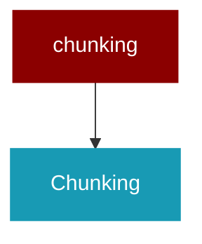

# chunking

<Badge color="blue">Core SDK</Badge>

## Overview



## Import

```python
from praisonaiagents import chunking
```

## Classes

<AccordionGroup>
### Chunking

A unified class for text chunking with various chunking strategies.

<Expandable title="Constructor Parameters">

<ParamField query="chunker_type" type="str">
   (default: `'token'`)
</ParamField>
<ParamField query="chunk_size" type="int">
   (default: `512`)
</ParamField>
<ParamField query="chunk_overlap" type="int">
   (default: `128`)
</ParamField>
<ParamField query="tokenizer_or_token_counter" type="str">
   (default: `'gpt2'`)
</ParamField>
<ParamField query="embedding_model" type="Optional">
   (default: `None`)
</ParamField>

</Expandable>

<AccordionGroup>
<Accordion title="SUPPORTED_CHUNKERS() -> Dict">
  Lazy load chunker classes.
</Accordion>
<Accordion title="embedding_model() -> Any">
  Lazy load the embedding model.
</Accordion>
<Accordion title="chunker() -> Any">
  Lazy load the chunker instance.
</Accordion>
<Accordion title="chunk(text: Union) -> Union">
  Chunk text using the configured chunking strategy.
</Accordion>
</AccordionGroup>

</AccordionGroup>
