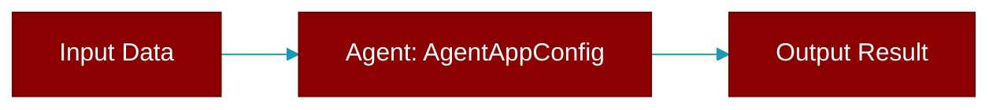

# AgentAppConfig

> Defined in the [**config**](../modules/config) module.

<Badge color="blue">AI Agent</Badge>

Configuration for AgentApp.

This dataclass holds all configuration options for an AgentApp instance.
It follows the PraisonAI principle of sensible defaults with explicit overrides.

Attributes:
    name: Name of the application (default: "PraisonAI App")
    host: Host address to bind to (default: "0.0.0.0")
    port: Port number to listen on (default: 8000)
    reload: Enable auto-reload for development (default: False)
    cors_origins: List of allowed CORS origins (default: ["*"])
    api_prefix: API route prefix (default: "/api")
    docs_url: URL for API documentation (default: "/docs")
    openapi_url: URL for OpenAPI schema (default: "/openapi.json")
    debug: Enable debug mode (default: False)
    log_level: Logging level (default: "info")
    workers: Number of worker processes (default: 1)
    timeout: Request timeout in seconds (default: 60)
    metadata: Additional metadata for the app



## Properties

<ResponseField name="name" type="str">
  No description available.
</ResponseField>

<ResponseField name="host" type="str">
  No description available.
</ResponseField>

<ResponseField name="port" type="int">
  No description available.
</ResponseField>

<ResponseField name="reload" type="bool">
  No description available.
</ResponseField>

<ResponseField name="cors_origins" type="List">
  No description available.
</ResponseField>

<ResponseField name="api_prefix" type="str">
  No description available.
</ResponseField>

<ResponseField name="docs_url" type="str">
  No description available.
</ResponseField>

<ResponseField name="openapi_url" type="str">
  No description available.
</ResponseField>

<ResponseField name="debug" type="bool">
  No description available.
</ResponseField>

<ResponseField name="log_level" type="str">
  No description available.
</ResponseField>

<ResponseField name="workers" type="int">
  No description available.
</ResponseField>

<ResponseField name="timeout" type="int">
  No description available.
</ResponseField>

<ResponseField name="metadata" type="Dict">
  No description available.
</ResponseField>

## Usage

```python
config = AgentAppConfig(
        name="My AI App",
        port=9000,
        reload=True,
        debug=True
    )
```


---

## Related Documentation

<CardGroup cols={2}>
  <Card title="Agents Concept" icon="robot" href="/docs/concepts/agents" />
  <Card title="Single Agent Guide" icon="book-open" href="/docs/guides/single-agent" />
  <Card title="Multi-Agent Guide" icon="users" href="/docs/guides/multi-agent" />
  <Card title="Agent Configuration" icon="gear" href="/docs/configuration/agent-config" />
  <Card title="Auto Agents" icon="wand-magic-sparkles" href="/docs/features/autoagents" />
</CardGroup>
