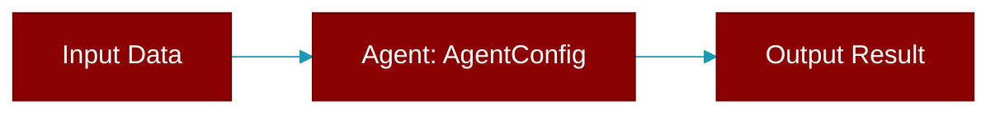

> Defined in the [**autoagents**](../modules/autoagents) module.

<Badge color="blue">AI Agent</Badge>

## Properties

<ResponseField name="name" type="str">
  No description available.
</ResponseField>

<ResponseField name="role" type="str">
  No description available.
</ResponseField>

<ResponseField name="goal" type="str">
  No description available.
</ResponseField>

<ResponseField name="backstory" type="str">
  No description available.
</ResponseField>

<ResponseField name="tools" type="List">
  No description available.
</ResponseField>

<ResponseField name="tasks" type="List">
  No description available.
</ResponseField>
