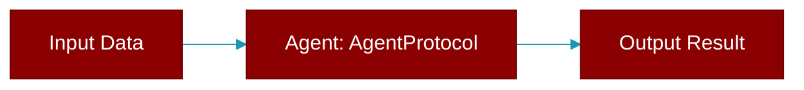

# AgentProtocol

> Defined in the [**protocols**](../modules/protocols) module.

<Badge color="blue">AI Agent</Badge>

Minimal Protocol for agent implementations.

This defines the essential interface that any agent must provide.
It enables proper mocking and testing without real LLM dependencies.



## Methods

<CardGroup cols={2}>
  <Card title="name()" icon="function" href="../functions/AgentProtocol-name">
    Agent's name identifier.
  </Card>
  <Card title="chat()" icon="function" href="../functions/AgentProtocol-chat">
    Synchronous chat with the agent.
  </Card>
  <Card title="achat()" icon="function" href="../functions/AgentProtocol-achat">
    Asynchronous chat with the agent.
  </Card>
</CardGroup>

## Usage

```python
# Create a mock agent for testing
    class MockAgent:
        @property
        def name(self) -> str:
            return "TestAgent"
        
        def chat(self, prompt: str, **kwargs) -> str:
            return "Mock response"
        
        async def achat(self, prompt: str, **kwargs) -> str:
            return "Async mock response"
    
    # Use in tests
    agent: AgentProtocol = MockAgent()
    result = agent.chat("Hello")
```


## Source

<Card title="View on GitHub" icon="github" href="https://github.com/MervinPraison/PraisonAI/blob/main/src/praisonai-agents/praisonaiagents/agent/protocols.py#L35">
  `praisonaiagents/agent/protocols.py` at line 35
</Card>


---

## Related Documentation

<CardGroup cols={2}>
  <Card title="Agents Concept" icon="robot" href="/docs/concepts/agents" />
  <Card title="Single Agent Guide" icon="book-open" href="/docs/guides/single-agent" />
  <Card title="Multi-Agent Guide" icon="users" href="/docs/guides/multi-agent" />
  <Card title="Agent Configuration" icon="gear" href="/docs/configuration/agent-config" />
  <Card title="Auto Agents" icon="wand-magic-sparkles" href="/docs/features/autoagents" />
</CardGroup>
