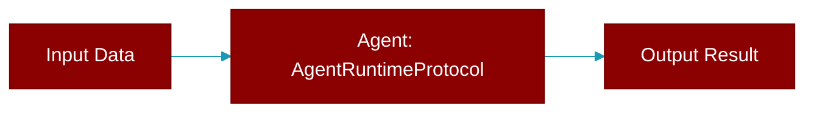

# AgentRuntimeProtocol

> Defined in the [**resolve**](../modules/resolve) module.

<Badge color="blue">AI Agent</Badge>

Extended protocol for agent-specific runtime features.

## Methods

<CardGroup cols={2}>
  <Card title="supports_streaming()" icon="function" href="../functions/AgentRuntimeProtocol-supports_streaming">
    Whether this runtime supports streaming responses.
  </Card>
  <Card title="supports_tools()" icon="function" href="../functions/AgentRuntimeProtocol-supports_tools">
    Whether this runtime supports tool calling.
  </Card>
</CardGroup>

## Source

<Card title="View on GitHub" icon="github" href="https://github.com/MervinPraison/PraisonAI/blob/main/src/praisonai-agents/praisonaiagents/runtime/resolve.py#L42">
  `praisonaiagents/runtime/resolve.py` at line 42
</Card>

---

## Related Documentation

<CardGroup cols={2}>
  <Card title="Agents Concept" icon="robot" href="/docs/concepts/agents" />
  <Card title="Single Agent Guide" icon="book-open" href="/docs/guides/single-agent" />
  <Card title="Multi-Agent Guide" icon="users" href="/docs/guides/multi-agent" />
  <Card title="Agent Configuration" icon="gear" href="/docs/configuration/agent-config" />
  <Card title="Auto Agents" icon="wand-magic-sparkles" href="/docs/features/autoagents" />
</CardGroup>
