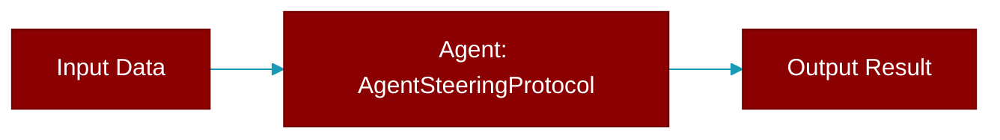

# AgentSteeringProtocol

> Defined in the [**protocols**](../modules/protocols) module.

<Badge color="blue">AI Agent</Badge>

Protocol for agents that support message steering.

This extends the agent interface with steering capabilities,
allowing real-time message injection during execution.

## Methods

<CardGroup cols={2}>
  <Card title="steer()" icon="function" href="../functions/AgentSteeringProtocol-steer">
    Send a steering message to the agent during execution.
  </Card>
  <Card title="get_steering_status()" icon="function" href="../functions/AgentSteeringProtocol-get_steering_status">
    Get current steering status.
  </Card>
  <Card title="message_steering_enabled()" icon="function" href="../functions/AgentSteeringProtocol-message_steering_enabled">
    Whether message steering is enabled for this agent.
  </Card>
</CardGroup>

## Source

<Card title="View on GitHub" icon="github" href="https://github.com/MervinPraison/PraisonAI/blob/main/src/praisonai-agents/praisonaiagents/agent/protocols.py#L548">
  `praisonaiagents/agent/protocols.py` at line 548
</Card>

---

## Related Documentation

<CardGroup cols={2}>
  <Card title="Agents Concept" icon="robot" href="/docs/concepts/agents" />
  <Card title="Single Agent Guide" icon="book-open" href="/docs/guides/single-agent" />
  <Card title="Multi-Agent Guide" icon="users" href="/docs/guides/multi-agent" />
  <Card title="Agent Configuration" icon="gear" href="/docs/configuration/agent-config" />
  <Card title="Auto Agents" icon="wand-magic-sparkles" href="/docs/features/autoagents" />
</CardGroup>
