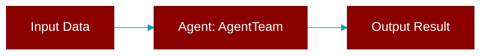

# AgentTeam

> Defined in the [**agents**](../modules/agents) module.

<Badge color="blue">AI Agent</Badge>

Multi-agent coordinator that manages and delegates work to multiple agents.

AgentTeam orchestrates the execution of tasks across multiple Agent instances,
supporting sequential, parallel, and hierarchical execution patterns.



## Constructor

<ParamField query="agents" type="Any" required={true}>
  No description available.
</ParamField>

<ParamField query="tasks" type="Any" required={false}>
  No description available.
</ParamField>

<ParamField query="process" type="Any" required={false} default="'sequential'">
  No description available.
</ParamField>

<ParamField query="manager_llm" type="Any" required={false}>
  No description available.
</ParamField>

<ParamField query="name" type="Optional" required={false}>
  No description available.
</ParamField>

<ParamField query="variables" type="Optional" required={false}>
  No description available.
</ParamField>

<ParamField query="llm" type="Optional" required={false}>
  No description available.
</ParamField>

<ParamField query="memory" type="Optional" required={false} default="False">
  No description available.
</ParamField>

<ParamField query="planning" type="Optional" required={false} default="False">
  No description available.
</ParamField>

<ParamField query="context" type="Optional" required={false} default="False">
  No description available.
</ParamField>

<ParamField query="output" type="Optional" required={false}>
  No description available.
</ParamField>

<ParamField query="execution" type="Optional" required={false}>
  No description available.
</ParamField>

<ParamField query="hooks" type="Optional" required={false}>
  No description available.
</ParamField>

<ParamField query="autonomy" type="Optional" required={false}>
  No description available.
</ParamField>

<ParamField query="knowledge" type="Optional" required={false}>
  No description available.
</ParamField>

<ParamField query="guardrails" type="Optional" required={false}>
  No description available.
</ParamField>

<ParamField query="web" type="Optional" required={false}>
  No description available.
</ParamField>

<ParamField query="reflection" type="Optional" required={false}>
  No description available.
</ParamField>

<ParamField query="caching" type="Optional" required={false}>
  No description available.
</ParamField>

## Methods

<CardGroup cols={2}>
  <Card title="add_task()" icon="function" href="../functions/AgentTeam-add_task">
    Instance method.
  </Card>
  <Card title="clean_json_output()" icon="function" href="../functions/AgentTeam-clean_json_output">
    Instance method.
  </Card>
  <Card title="context_manager()" icon="function" href="../functions/AgentTeam-context_manager">
    ContextManager instance for unified context management across all agents.
  </Card>
  <Card title="default_completion_checker()" icon="function" href="../functions/AgentTeam-default_completion_checker">
    Instance method.
  </Card>
  <Card title="aexecute_task()" icon="function" href="../functions/AgentTeam-aexecute_task">
    Async version of execute_task method
  </Card>
  <Card title="arun_task()" icon="function" href="../functions/AgentTeam-arun_task">
    Async version of run_task method
  </Card>
  <Card title="arun_all_tasks()" icon="function" href="../functions/AgentTeam-arun_all_tasks">
    Async version of run_all_tasks method
  </Card>
  <Card title="astart()" icon="function" href="../functions/AgentTeam-astart">
    Async version of start method.
  </Card>
  <Card title="save_output_to_file()" icon="function" href="../functions/AgentTeam-save_output_to_file">
    Instance method.
  </Card>
  <Card title="execute_task()" icon="function" href="../functions/AgentTeam-execute_task">
    Synchronous version of execute_task method
  </Card>
  <Card title="run_task()" icon="function" href="../functions/AgentTeam-run_task">
    Synchronous version of run_task method
  </Card>
  <Card title="run_all_tasks()" icon="function" href="../functions/AgentTeam-run_all_tasks">
    Synchronous version of run_all_tasks method
  </Card>
  <Card title="get_task_status()" icon="function" href="../functions/AgentTeam-get_task_status">
    Instance method.
  </Card>
  <Card title="get_all_tasks_status()" icon="function" href="../functions/AgentTeam-get_all_tasks_status">
    Instance method.
  </Card>
  <Card title="get_task_result()" icon="function" href="../functions/AgentTeam-get_task_result">
    Instance method.
  </Card>
  <Card title="get_task_details()" icon="function" href="../functions/AgentTeam-get_task_details">
    Instance method.
  </Card>
  <Card title="get_agent_details()" icon="function" href="../functions/AgentTeam-get_agent_details">
    Instance method.
  </Card>
  <Card title="start()" icon="function" href="../functions/AgentTeam-start">
    Start agent execution with verbose output (beginner-friendly).
  </Card>
  <Card title="run()" icon="function" href="../functions/AgentTeam-run">
    Run agents silently (production use).
  </Card>
  <Card title="set_state()" icon="function" href="../functions/AgentTeam-set_state">
    Set a state value
  </Card>
  <Card title="get_state()" icon="function" href="../functions/AgentTeam-get_state">
    Get a state value
  </Card>
  <Card title="update_state()" icon="function" href="../functions/AgentTeam-update_state">
    Update multiple state values
  </Card>
  <Card title="clear_state()" icon="function" href="../functions/AgentTeam-clear_state">
    Clear all state values
  </Card>
  <Card title="has_state()" icon="function" href="../functions/AgentTeam-has_state">
    Check if a state key exists
  </Card>
  <Card title="get_all_state()" icon="function" href="../functions/AgentTeam-get_all_state">
    Get a copy of the entire state dictionary
  </Card>
  <Card title="delete_state()" icon="function" href="../functions/AgentTeam-delete_state">
    Delete a state key if it exists. Returns True if deleted, False if key didn't exist.
  </Card>
  <Card title="increment_state()" icon="function" href="../functions/AgentTeam-increment_state">
    Increment a numeric state value. Creates the key with default if it doesn't exist.
  </Card>
  <Card title="append_to_state()" icon="function" href="../functions/AgentTeam-append_to_state">
    Append a value to a list state. Creates the list if it doesn't exist.
  </Card>
  <Card title="save_session_state()" icon="function" href="../functions/AgentTeam-save_session_state">
    Save current state to memory for session persistence
  </Card>
  <Card title="restore_session_state()" icon="function" href="../functions/AgentTeam-restore_session_state">
    Restore state from memory for session persistence. Returns True if restored.
  </Card>
  <Card title="get_token_usage_summary()" icon="function" href="../functions/AgentTeam-get_token_usage_summary">
    Get a summary of token usage across all agents and tasks.
  </Card>
  <Card title="get_detailed_token_report()" icon="function" href="../functions/AgentTeam-get_detailed_token_report">
    Get a detailed token usage report.
  </Card>
  <Card title="display_token_usage()" icon="function" href="../functions/AgentTeam-display_token_usage">
    Display token usage in a formatted table.
  </Card>
  <Card title="launch()" icon="function" href="../functions/AgentTeam-launch">
    Launch all agents as a single API endpoint (HTTP) or an MCP server.
  </Card>
  <Card title="current_plan()" icon="function" href="../functions/AgentTeam-current_plan">
    Get the current plan.
  </Card>
  <Card title="todo_list()" icon="function" href="../functions/AgentTeam-todo_list">
    Get the current todo list.
  </Card>
  <Card title="get_plan_markdown()" icon="function" href="../functions/AgentTeam-get_plan_markdown">
    Get the current plan as markdown.
  </Card>
  <Card title="get_todo_markdown()" icon="function" href="../functions/AgentTeam-get_todo_markdown">
    Get the current todo list as markdown.
  </Card>
  <Card title="update_plan_step_status()" icon="function" href="../functions/AgentTeam-update_plan_step_status">
    Update the status of a plan step.
  </Card>
</CardGroup>

## Usage

```python
from praisonaiagents import Agent, AgentTeam, Task
    
    researcher = Agent(role="Researcher", instructions="Research topics")
    writer = Agent(role="Writer", instructions="Write content")
    
    task1 = Task(description="Research AI trends", agent=researcher)
    task2 = Task(description="Write article", agent=writer)
    
    team = AgentTeam(
        agents=[researcher, writer],
        tasks=[task1, task2],
        process="sequential"
    )
    result = team.start()
```


## Notes

The class was renamed from `AgentManager` to `AgentTeam` in v1.0.
    `AgentManager` and `Agents` remain as silent aliases for backward compatibility.


## Source

<Card title="View on GitHub" icon="github" href="https://github.com/MervinPraison/PraisonAI/blob/main/src/praisonai-agents/praisonaiagents/agents/agents.py#L172">
  `praisonaiagents/agents/agents.py` at line 172
</Card>


---

## Related Documentation

<CardGroup cols={2}>
  <Card title="Agents Concept" icon="robot" href="/docs/concepts/agents" />
  <Card title="Single Agent Guide" icon="book-open" href="/docs/guides/single-agent" />
  <Card title="Multi-Agent Guide" icon="users" href="/docs/guides/multi-agent" />
  <Card title="Agent Configuration" icon="gear" href="/docs/configuration/agent-config" />
  <Card title="Auto Agents" icon="wand-magic-sparkles" href="/docs/features/autoagents" />
</CardGroup>
