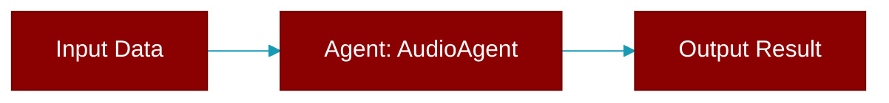

# AudioAgent

> Defined in the [**audio_agent**](../modules/audio_agent) module.

A specialized agent for audio processing using AI models.

Provides:
- Text-to-Speech (TTS): Convert text to spoken audio
- Speech-to-Text (STT): Transcribe audio to text

TTS Providers:
    - OpenAI: `openai/tts-1`, `openai/tts-1-hd`
    - Azure: `azure/tts-1`
    - Gemini: `gemini/gemini-2.5-flash-preview-tts`
    - Vertex AI: `vertex_ai/gemini-2.5-flash-preview-tts`
    - ElevenLabs: `elevenlabs/eleven_multilingual_v2`
    - MiniMax: `minimax/speech-01`

STT Providers:
    - OpenAI: `openai/whisper-1`
    - Azure: `azure/whisper`
    - Groq: `groq/whisper-large-v3`
    - Deepgram: `deepgram/nova-2`
    - Gemini: `gemini/gemini-2.0-flash`



## Constructor

<ParamField query="name" type="Optional" required={false}>
  No description available.
</ParamField>

<ParamField query="instructions" type="Optional" required={false}>
  No description available.
</ParamField>

<ParamField query="llm" type="Optional" required={false}>
  No description available.
</ParamField>

<ParamField query="model" type="Optional" required={false}>
  No description available.
</ParamField>

<ParamField query="base_url" type="Optional" required={false}>
  No description available.
</ParamField>

<ParamField query="api_key" type="Optional" required={false}>
  No description available.
</ParamField>

<ParamField query="audio" type="Optional" required={false}>
  No description available.
</ParamField>

<ParamField query="verbose" type="Union" required={false} default="True">
  No description available.
</ParamField>

## Methods

<CardGroup cols={2}>
  <Card title="console()" icon="function" href="../functions/AudioAgent-console">
    Lazily initialize Rich Console.
  </Card>
  <Card title="litellm()" icon="function" href="../functions/AudioAgent-litellm">
    Lazy load litellm module when needed.
  </Card>
  <Card title="speech()" icon="function" href="../functions/AudioAgent-speech">
    Convert text to speech.
  </Card>
  <Card title="aspeech()" icon="function" href="../functions/AudioAgent-aspeech">
    Async version of speech().
  </Card>
  <Card title="transcribe()" icon="function" href="../functions/AudioAgent-transcribe">
    Transcribe audio to text.
  </Card>
  <Card title="atranscribe()" icon="function" href="../functions/AudioAgent-atranscribe">
    Async version of transcribe().
  </Card>
  <Card title="say()" icon="function" href="../functions/AudioAgent-say">
    Quick TTS - convert text and save to file.
  </Card>
  <Card title="asay()" icon="function" href="../functions/AudioAgent-asay">
    Async version of say().
  </Card>
  <Card title="listen()" icon="function" href="../functions/AudioAgent-listen">
    Quick STT - transcribe audio file.
  </Card>
  <Card title="alisten()" icon="function" href="../functions/AudioAgent-alisten">
    Async version of listen().
  </Card>
</CardGroup>

## Usage

```python
from praisonaiagents import AudioAgent
    
    # Text-to-Speech
    agent = AudioAgent(llm="openai/tts-1")
    agent.speech("Hello world!", output="hello.mp3")
    
    # Speech-to-Text
    agent = AudioAgent(llm="openai/whisper-1")
    text = agent.transcribe("audio.mp3")
    print(text)
```
