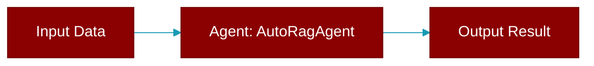

> Defined in the [**auto_rag_agent**](../modules/auto_rag_agent) module.

Agent wrapper with automatic RAG retrieval decision.

Decides when to perform retrieval based on policy and heuristics,
then composes RAG context with Agent chat.

This follows the same pattern as AutoAgents but for RAG:
- AutoAgents: auto-generates agent configs from instructions
- AutoRagAgent: auto-decides when to retrieve context



## Constructor

<ParamField query="agent" type="Agent" required={true}>
  No description available.
</ParamField>

<ParamField query="rag" type="Optional" required={false}>
  No description available.
</ParamField>

<ParamField query="config" type="Optional" required={false}>
  No description available.
</ParamField>

## Methods

<CardGroup cols={2}>
  <Card title="rag()" icon="function" href="../functions/AutoRagAgent-rag">
    Lazy load RAG from agent if not provided.
  </Card>
  <Card title="name()" icon="function" href="../functions/AutoRagAgent-name">
    Delegate name to wrapped agent.
  </Card>
  <Card title="chat()" icon="function" href="../functions/AutoRagAgent-chat">
    Chat with automatic RAG retrieval decision.
  </Card>
  <Card title="achat()" icon="function" href="../functions/AutoRagAgent-achat">
    Async version of chat.
  </Card>
</CardGroup>

## Usage

```python
from praisonaiagents import Agent, AutoRagAgent
    
    agent = Agent(
        name="Research Assistant",
        knowledge=["docs/manual.pdf"],
    )
    
    auto_rag = AutoRagAgent(agent=agent)
    
    # Auto mode - decides based on query
    result = auto_rag.chat("What are the key findings?")
    
    # Force retrieval
    result = auto_rag.chat("Hello", force_retrieval=True)
    
    # Skip retrieval
    result = auto_rag.chat("What is 2+2?", skip_retrieval=True)
```
