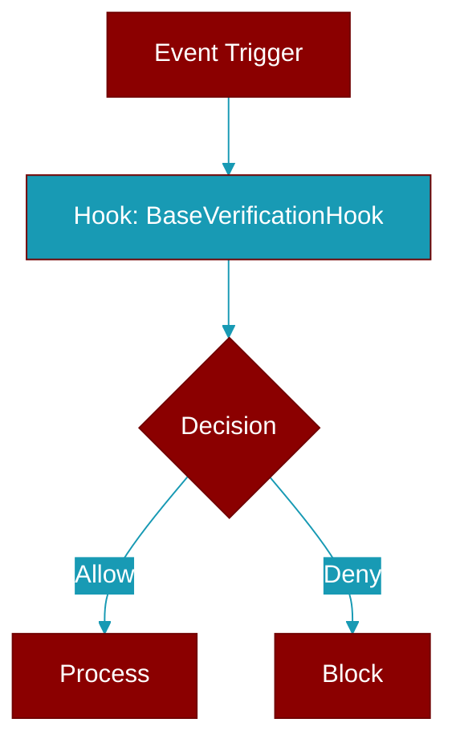

# BaseVerificationHook

> Defined in the [**verification**](../modules/verification) module.

Base class for verification hooks.

Provides common functionality for verification hooks.
Subclass this to create custom verification hooks.



## Constructor

<ParamField query="name" type="Optional" required={false}>
  No description available.
</ParamField>

<ParamField query="timeout" type="float" required={false} default="60.0">
  No description available.
</ParamField>

## Properties

<ResponseField name="name" type="str">
  No description available.
</ResponseField>

<ResponseField name="timeout_seconds" type="float">
  No description available.
</ResponseField>

## Methods

<CardGroup cols={2}>
  <Card title="run()" icon="function" href="../functions/BaseVerificationHook-run">
    Run the verification hook.
  </Card>
</CardGroup>

## Usage

```python
class MyTestRunner(BaseVerificationHook):
        name = "my_tests"
        
        def _execute(self, context):
            # Run your tests
            return VerificationResult(success=True, output="Tests passed")
```
