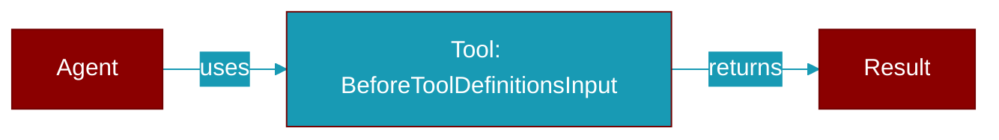

# BeforeToolDefinitionsInput

> Defined in the [**events**](../modules/events) module.

<Badge color="blue">AI Agent</Badge>

Input for BeforeToolDefinitions hooks.

Fired right after the advertised tool definitions are assembled for a
request and before they reach the LLM. Hooks should modify or filter the
``tool_definitions`` list in place (e.g. ``data.tool_definitions[:] = ...``)
to redact parameters, append usage guidance to descriptions, or constrain
the advertised schema per request. This mirrors how BEFORE_LLM mutates its
payload in place; only in-place mutations are adopted by the runtime.

## Properties

<ResponseField name="tool_definitions" type="List">
  No description available.
</ResponseField>

<ResponseField name="model" type="str">
  No description available.
</ResponseField>

<Accordion title="Internal & Generic Methods">
- **to_dict**: Generic utility method.
</Accordion>

## Source

<Card title="View on GitHub" icon="github" href="https://github.com/MervinPraison/PraisonAI/blob/main/src/praisonai-agents/praisonaiagents/hooks/events.py#L51">
  `praisonaiagents/hooks/events.py` at line 51
</Card>

---

## Related Documentation

<CardGroup cols={2}>
  <Card title="Tools Concept" icon="wrench" href="/docs/concepts/tools" />
  <Card title="Create Custom Tools" icon="plus" href="/docs/guides/tools/create-custom-tools" />
  <Card title="Tool Development" icon="code" href="/docs/tutorials/advanced-tool-development" />
</CardGroup>
