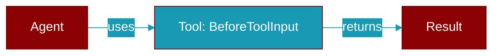

# BeforeToolInput

> Defined in the [**events**](../modules/events) module.

<Badge color="blue">AI Agent</Badge>

Input for BeforeTool hooks.

## Properties

<ResponseField name="tool_name" type="str">
  No description available.
</ResponseField>

<ResponseField name="tool_input" type="Dict">
  No description available.
</ResponseField>

<ResponseField name="tool_description" type="Optional">
  No description available.
</ResponseField>

<Accordion title="Internal & Generic Methods">
- **to_dict**: Generic utility method.
</Accordion>

---

## Related Documentation

<CardGroup cols={2}>
  <Card title="Tools Concept" icon="wrench" href="/docs/concepts/tools" />
  <Card title="Create Custom Tools" icon="plus" href="/docs/guides/tools/create-custom-tools" />
  <Card title="Tool Development" icon="code" href="/docs/tutorials/advanced-tool-development" />
</CardGroup>
