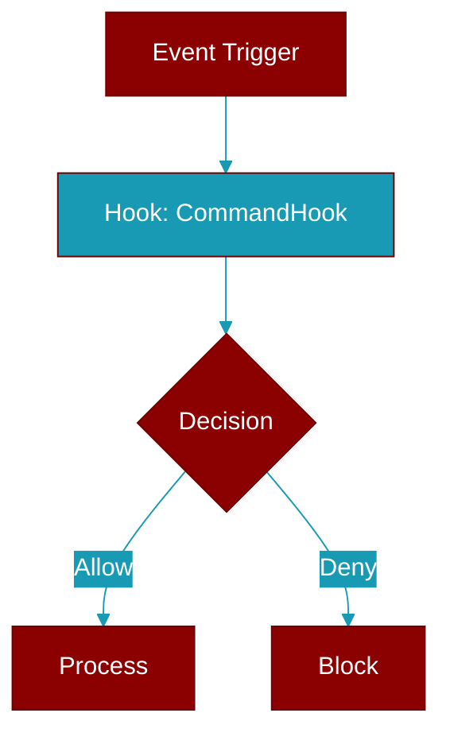

# CommandHook

> Defined in the [**types**](../modules/types) module.

<Badge color="blue">AI Agent</Badge>

Hook that executes a shell command.

## Properties

<ResponseField name="command" type="str">
  No description available.
</ResponseField>

<ResponseField name="shell" type="bool">
  No description available.
</ResponseField>

<ResponseField name="env" type="Dict">
  No description available.
</ResponseField>
