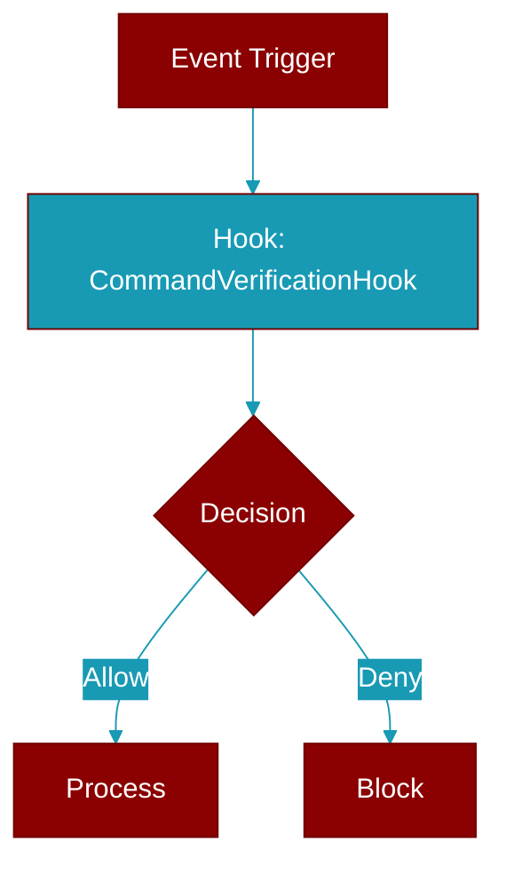

# CommandVerificationHook

> Defined in the [**verification**](../modules/verification) module.

Verification hook that runs a shell command.



## Constructor

<ParamField query="name" type="str" required={true}>
  No description available.
</ParamField>

<ParamField query="command" type="list" required={true}>
  No description available.
</ParamField>

<ParamField query="cwd" type="Optional" required={false}>
  No description available.
</ParamField>

<ParamField query="timeout" type="float" required={false} default="60.0">
  No description available.
</ParamField>

## Usage

```python
hook = CommandVerificationHook(
        name="pytest",
        command=["pytest", "-v", "--tb=short"]
    )
```
