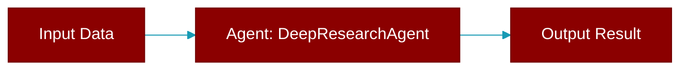

# DeepResearchAgent

> Defined in the [**deep_research_agent**](../modules/deep_research_agent) module.

Agent for performing deep research using multiple provider APIs.

Supports:
- **OpenAI Deep Research**: o3-deep-research, o4-mini-deep-research
- **Gemini Deep Research**: deep-research-pro-preview
- **LiteLLM**: Unified interface for OpenAI models

The provider is auto-detected based on the model name, or can be explicitly set.



## Constructor

<ParamField query="name" type="Optional" required={false}>
  No description available.
</ParamField>

<ParamField query="instructions" type="Optional" required={false}>
  No description available.
</ParamField>

<ParamField query="model" type="str" required={false} default="'o3-deep-research'">
  No description available.
</ParamField>

<ParamField query="provider" type="Optional" required={false} default="'auto'">
  No description available.
</ParamField>

<ParamField query="api_key" type="Optional" required={false}>
  No description available.
</ParamField>

<ParamField query="base_url" type="Optional" required={false}>
  No description available.
</ParamField>

<ParamField query="verbose" type="bool" required={false} default="True">
  No description available.
</ParamField>

<ParamField query="summary_mode" type="Literal" required={false} default="'auto'">
  No description available.
</ParamField>

<ParamField query="enable_web_search" type="bool" required={false} default="True">
  No description available.
</ParamField>

<ParamField query="enable_code_interpreter" type="bool" required={false} default="False">
  No description available.
</ParamField>

<ParamField query="enable_file_search" type="bool" required={false} default="False">
  No description available.
</ParamField>

<ParamField query="mcp_servers" type="Optional" required={false}>
  No description available.
</ParamField>

<ParamField query="file_search_stores" type="Optional" required={false}>
  No description available.
</ParamField>

<ParamField query="use_litellm" type="bool" required={false} default="False">
  No description available.
</ParamField>

<ParamField query="poll_interval" type="int" required={false} default="10">
  No description available.
</ParamField>

<ParamField query="max_wait_time" type="int" required={false} default="3600">
  No description available.
</ParamField>

## Methods

<CardGroup cols={2}>
  <Card title="openai_client()" icon="function" href="../functions/DeepResearchAgent-openai_client">
    Get the synchronous OpenAI client (lazy initialization).
  </Card>
  <Card title="async_openai_client()" icon="function" href="../functions/DeepResearchAgent-async_openai_client">
    Get the asynchronous OpenAI client (lazy initialization).
  </Card>
  <Card title="gemini_client()" icon="function" href="../functions/DeepResearchAgent-gemini_client">
    Get the Gemini client (lazy initialization).
  </Card>
  <Card title="research()" icon="function" href="../functions/DeepResearchAgent-research">
    Perform a deep research query.
  </Card>
  <Card title="aresearch()" icon="function" href="../functions/DeepResearchAgent-aresearch">
    Async version of research().
  </Card>
  <Card title="follow_up()" icon="function" href="../functions/DeepResearchAgent-follow_up">
    Ask a follow-up question based on a previous research interaction.
  </Card>
  <Card title="clarify()" icon="function" href="../functions/DeepResearchAgent-clarify">
    Generate clarifying questions for a research query.
  </Card>
  <Card title="rewrite_query()" icon="function" href="../functions/DeepResearchAgent-rewrite_query">
    Rewrite a research query to be more specific and detailed.
  </Card>
</CardGroup>

## Usage

```python
# OpenAI (default)
    agent = DeepResearchAgent(
        model="o3-deep-research",
        instructions="You are a professional researcher."
    )
    
    # Gemini
    agent = DeepResearchAgent(
        model="deep-research-pro",
        instructions="You are a professional researcher."
    )
    
    # Using LiteLLM
    agent = DeepResearchAgent(
        model="o3-deep-research",
        use_litellm=True
    )
    
    result = agent.research("Research the economic impact of AI on healthcare.")
    print(result.report)
```
