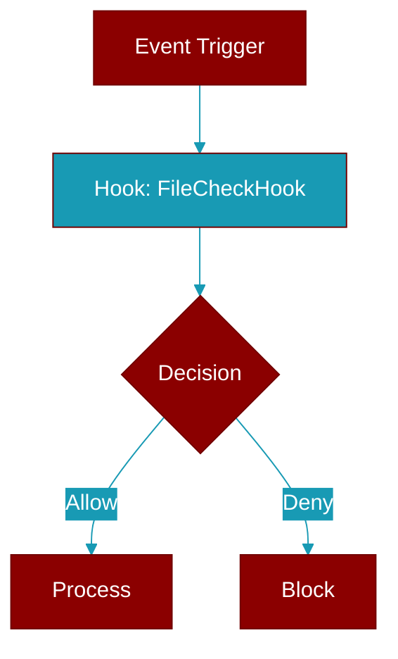

# FileCheckHook

> Defined in the [**verification**](../modules/verification) module.

<Badge color="blue">AI Agent</Badge>

Declarative file-assertion verification hook (no shell involved).

Checks portable filesystem facts:
  - ``exists``    : the file exists (default True).
  - ``non_empty`` : the file has non-zero size.
  - ``contains``  : the file text contains a substring.
  - ``json_field``/``equals`` : the JSON value at a dotted path equals a value.



## Constructor

<ParamField query="name" type="str" required={true}>
  No description available.
</ParamField>

<ParamField query="path" type="str" required={true}>
  No description available.
</ParamField>

<ParamField query="exists" type="bool" required={false} default="True">
  No description available.
</ParamField>

<ParamField query="non_empty" type="bool" required={false} default="False">
  No description available.
</ParamField>

<ParamField query="contains" type="Optional[str]" required={false}>
  No description available.
</ParamField>

<ParamField query="json_field" type="Optional[str]" required={false}>
  No description available.
</ParamField>

<ParamField query="equals" type="Any" required={false}>
  No description available.
</ParamField>

<ParamField query="blocking" type="bool" required={false} default="True">
  No description available.
</ParamField>

## Usage

```python
hook = FileCheckHook(name="changelog", path="CHANGELOG.md", non_empty=True)
    hook = FileCheckHook(name="cfg", path="out.json",
                         json_field="status.code", equals=0)
```


## Source

<Card title="View on GitHub" icon="github" href="https://github.com/MervinPraison/PraisonAI/blob/main/src/praisonai-agents/praisonaiagents/hooks/verification.py#L275">
  `praisonaiagents/hooks/verification.py` at line 275
</Card>


---

## Related Documentation

<CardGroup cols={2}>
  <Card title="Hooks Concept" icon="anchor" href="/docs/concepts/hooks" />
  <Card title="Hook Events" icon="bolt" href="/docs/features/hook-events" />
  <Card title="Callbacks" icon="phone" href="/docs/features/callbacks" />
</CardGroup>
