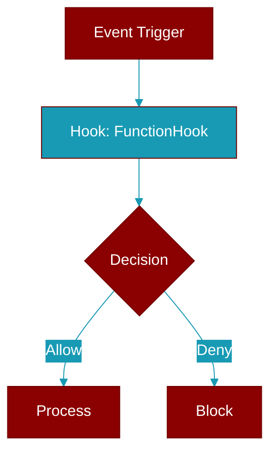

# FunctionHook

> Defined in the [**types**](../modules/types) module.

Hook that executes a Python function.

## Properties

<ResponseField name="func" type="Optional">
  No description available.
</ResponseField>

<ResponseField name="is_async" type="bool">
  No description available.
</ResponseField>
