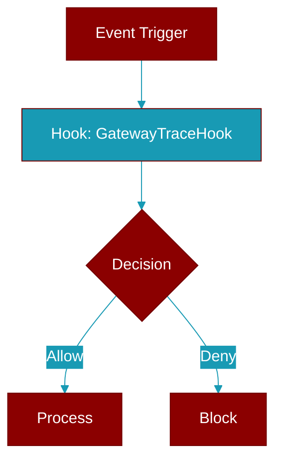

# GatewayTraceHook

> Defined in the [**protocols**](../modules/protocols) module.

<Badge color="blue">AI Agent</Badge>

Structural contract for tracing a gateway pipeline stage as a span.

A hook is fired around each stage of the inbound -&gt; agent -&gt; tool -&gt;
delivery pipeline. Implementations return a context manager whose scope is
the span: entering starts it, exiting ends it, and an exception propagating
out marks the span as failed. The default core implementation
(:class:`NullGatewayTraceHook`) is a no-op so tracing is zero-cost when no
exporter is attached.

The contract is deliberately dependency-free: no OpenTelemetry import lives
in core. A ``praisonai-plugins`` exporter implements ``stage`` with
``tracer.start_as_current_span(...)`` and carries the correlation id as a
span attribute. Example::

    with self._trace.stage(
        "agent.run",
        correlation_id=current_correlation_id(),
        session=sid,
    ):
        reply = await agent.astart(text)

## Methods

<CardGroup cols={2}>
  <Card title="stage()" icon="function" href="../functions/GatewayTraceHook-stage">
    Open a tracing scope for pipeline stage ``name``.
  </Card>
</CardGroup>

## Source

<Card title="View on GitHub" icon="github" href="https://github.com/MervinPraison/PraisonAI/blob/main/src/praisonai-agents/praisonaiagents/gateway/protocols.py#L4904">
  `praisonaiagents/gateway/protocols.py` at line 4904
</Card>

---

## Related Documentation

<CardGroup cols={2}>
  <Card title="Hooks Concept" icon="anchor" href="/docs/concepts/hooks" />
  <Card title="Hook Events" icon="bolt" href="/docs/features/hook-events" />
  <Card title="Callbacks" icon="phone" href="/docs/features/callbacks" />
  <Card title="Gateway Feature" icon="tower-broadcast" href="/docs/features/gateway" />
</CardGroup>
