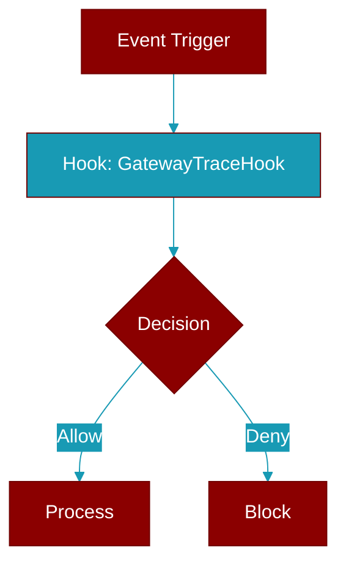

# GatewayTraceHook

> Defined in the [**protocols**](../modules/protocols) module.

<Badge color="blue">AI Agent</Badge>

Structural contract for tracing a gateway pipeline stage as a span.

A hook is fired around each stage of the inbound -&gt; agent -&gt; tool -&gt;
delivery pipeline. Implementations return a context manager whose scope is
the span: entering starts it, exiting ends it, and an exception propagating
out marks the span as failed. The default core implementation
(:class:`NullGatewayTraceHook`) is a no-op so tracing is zero-cost when no
exporter is attached.

The contract is deliberately dependency-free: no OpenTelemetry import lives
in core. A ``praisonai-plugins`` exporter implements ``stage`` with
``tracer.start_as_current_span(...)`` and carries the correlation id as a
span attribute. Example::

    with self._trace.stage(
        "agent.run",
        correlation_id=current_correlation_id(),
        session=sid,
    ):
        reply = await agent.astart(text)

W3C trace-context propagation is layered on top of the same seam without
forcing OpenTelemetry into core. ``stage`` accepts an optional
``parent_carrier`` (a header mapping such as an inbound request's
``&#123;"traceparent": ..., "tracestate": ...&#125;``) so an exporter can *continue*
an upstream caller's trace instead of starting a detached one; and the two
companion methods let egress call sites propagate the active span context:

    # ingress: continue the caller's trace when a traceparent arrives
    with self._trace.stage("agent.run", parent_carrier=inbound.headers):
        ...

    # egress: write the active traceparent onto an outbound request.
    # Seed with provider headers first, then inject last so the active
    # trace context always wins over any stale traceparent/tracestate.
    headers = dict(provider_headers)
    self._trace.inject_context(headers)  # no-op unless an exporter is set

Both companion methods are no-ops in :class:`NullGatewayTraceHook`, so the
default path stays zero-cost and OpenTelemetry-free.

## Methods

<CardGroup cols={2}>
  <Card title="stage()" icon="function" href="../functions/GatewayTraceHook-stage">
    Open a tracing scope for pipeline stage ``name``.
  </Card>
  <Card title="inject_context()" icon="function" href="../functions/GatewayTraceHook-inject_context">
    Write the active span context into ``carrier`` as W3C headers.
  </Card>
  <Card title="extract_carrier()" icon="function" href="../functions/GatewayTraceHook-extract_carrier">
    Return a propagation carrier extracted from inbound ``carrier``.
  </Card>
</CardGroup>

## Source

<Card title="View on GitHub" icon="github" href="https://github.com/MervinPraison/PraisonAI/blob/main/src/praisonai-agents/praisonaiagents/gateway/protocols.py#L5157">
  `praisonaiagents/gateway/protocols.py` at line 5157
</Card>

---

## Related Documentation

<CardGroup cols={2}>
  <Card title="Hooks Concept" icon="anchor" href="/docs/concepts/hooks" />
  <Card title="Hook Events" icon="bolt" href="/docs/features/hook-events" />
  <Card title="Callbacks" icon="phone" href="/docs/features/callbacks" />
  <Card title="Gateway Feature" icon="tower-broadcast" href="/docs/features/gateway" />
</CardGroup>
