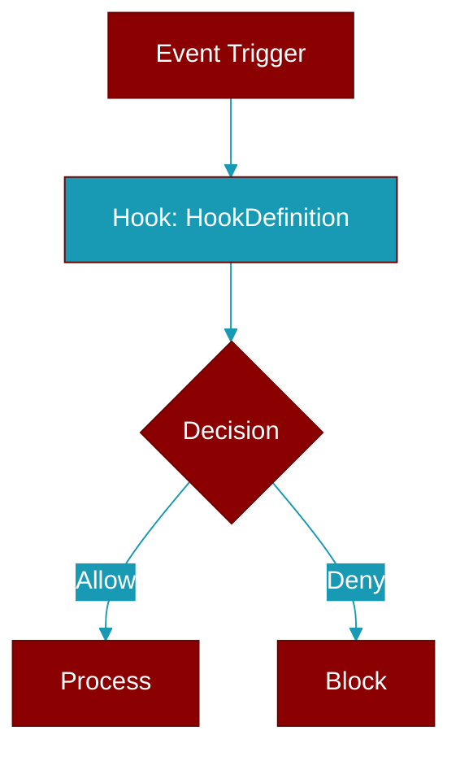

# HookDefinition

> Defined in the [**types**](../modules/types) module.

<Badge color="blue">AI Agent</Badge>

Hook definition with matcher and configuration.

## Properties

<ResponseField name="id" type="str">
  No description available.
</ResponseField>

<ResponseField name="event" type="HookEvent">
  No description available.
</ResponseField>

<ResponseField name="matcher" type="Optional">
  No description available.
</ResponseField>

<ResponseField name="sequential" type="bool">
  No description available.
</ResponseField>

<ResponseField name="enabled" type="bool">
  No description available.
</ResponseField>

<ResponseField name="name" type="Optional">
  No description available.
</ResponseField>

<ResponseField name="description" type="Optional">
  No description available.
</ResponseField>

<ResponseField name="timeout" type="float">
  No description available.
</ResponseField>

## Methods

<CardGroup cols={2}>
  <Card title="matches()" icon="function" href="../functions/HookDefinition-matches">
    Check if this hook matches the target (tool name, etc.).
  </Card>
</CardGroup>
