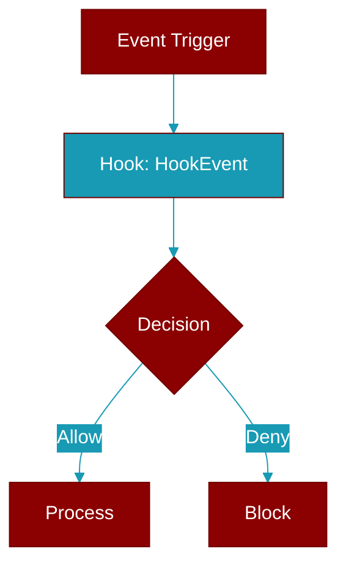

# HookEvent

> Defined in the [**types**](../modules/types) module.

<Badge color="blue">AI Agent</Badge>

Event names for the hook system.

This enum is also aliased as PluginHook for backward compatibility.
All plugin lifecycle events are included here for DRY compliance.

