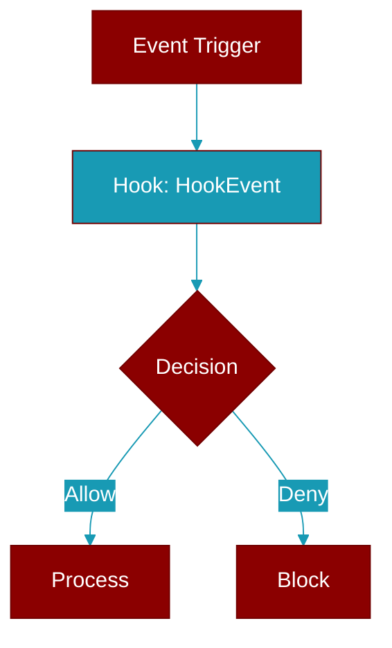

# HookEvent

> Defined in the [**types**](../modules/types) module.

<Badge color="blue">AI Agent</Badge>

Event names for the hook system.

This enum is also aliased as PluginHook for backward compatibility.
All plugin lifecycle events are included here for DRY compliance.

Invariant: every member declared here must have a real emission site, or be
an explicit alias of a member that does. A member that is neither makes
``registry.on(HookEvent.X)`` succeed and then never fire -- silence on a
plausible-looking registration. ``BEFORE_MESSAGE``, ``AFTER_MESSAGE`` and
``TOOL_RESULT_PERSIST`` are aliases (same value =&gt; same member); everything
else is emitted somewhere in the monorepo, which
``tests/unit/hooks/test_dead_hook_events.py`` enforces.

```mermaid
%%{init: {'theme': 'base', 'themeVariables': { 'primaryColor': '#8B0000', 'primaryTextColor': '#fff', 'primaryBorderColor': '#710101', 'lineColor': '#189AB4', 'secondaryColor': '#189AB4', 'tertiaryColor': '#fff' }}}%%

graph TD
    event["Event Trigger"] --> hook["Hook: HookEvent"]
    hook --> decision{"Decision"}
    decision -- "Allow" --> proc["Process"]
    decision -- "Deny" --> block["Block"]
    style hook fill:#189AB4,color:#fff
    style event fill:#8B0000,color:#fff
    style proc fill:#8B0000,color:#fff
    style block fill:#8B0000,color:#fff
```

## Source

<Card title="View on GitHub" icon="github" href="https://github.com/MervinPraison/PraisonAI/blob/main/src/praisonai-agents/praisonaiagents/hooks/types.py#L13">
  `praisonaiagents/hooks/types.py` at line 13
</Card>

---

## Related Documentation

<CardGroup cols={2}>
  <Card title="Hooks Concept" icon="anchor" href="/docs/concepts/hooks" />
  <Card title="Hook Events" icon="bolt" href="/docs/features/hook-events" />
  <Card title="Callbacks" icon="phone" href="/docs/features/callbacks" />
</CardGroup>
