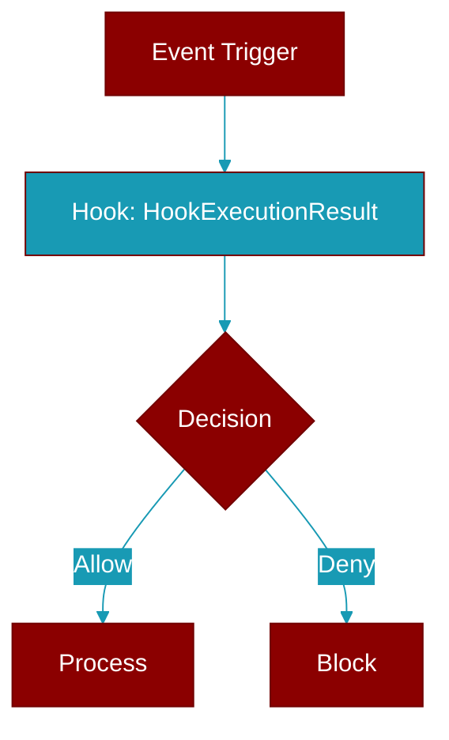

# HookExecutionResult

> Defined in the [**types**](../modules/types) module.

<Badge color="blue">AI Agent</Badge>

Result of executing a single hook.

## Properties

<ResponseField name="hook_id" type="str">
  No description available.
</ResponseField>

<ResponseField name="hook_name" type="str">
  No description available.
</ResponseField>

<ResponseField name="event" type="HookEvent">
  No description available.
</ResponseField>

<ResponseField name="success" type="bool">
  No description available.
</ResponseField>

<ResponseField name="output" type="Optional">
  No description available.
</ResponseField>

<ResponseField name="stdout" type="Optional">
  No description available.
</ResponseField>

<ResponseField name="stderr" type="Optional">
  No description available.
</ResponseField>

<ResponseField name="exit_code" type="Optional">
  No description available.
</ResponseField>

<ResponseField name="duration_ms" type="float">
  No description available.
</ResponseField>

<ResponseField name="error" type="Optional">
  No description available.
</ResponseField>

<Accordion title="Internal & Generic Methods">
- **to_dict**: Convert to dictionary.
</Accordion>
