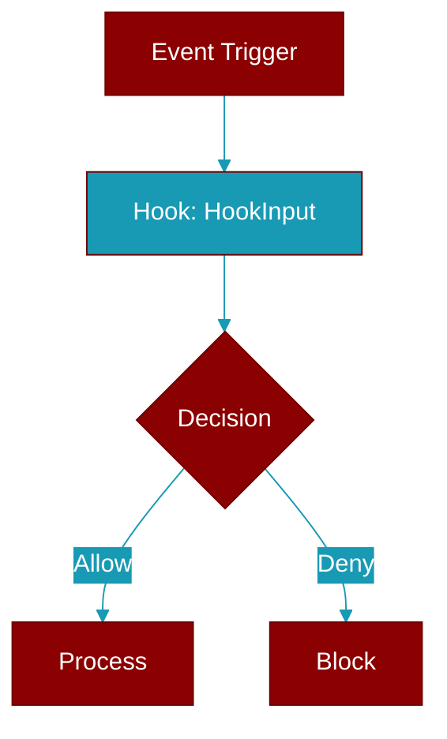

# HookInput

> Defined in the [**types**](../modules/types) module.

Base hook input - common fields for all events.

## Properties

<ResponseField name="session_id" type="str">
  No description available.
</ResponseField>

<ResponseField name="cwd" type="str">
  No description available.
</ResponseField>

<ResponseField name="event_name" type="str">
  No description available.
</ResponseField>

<ResponseField name="timestamp" type="str">
  No description available.
</ResponseField>

<ResponseField name="agent_name" type="Optional">
  No description available.
</ResponseField>

<ResponseField name="extra" type="Dict">
  No description available.
</ResponseField>

## Methods

<CardGroup cols={2}>
  <Card title="to_dict()" icon="function" href="../functions/HookInput-to_dict">
    Convert to dictionary for JSON serialization.
  </Card>
</CardGroup>
