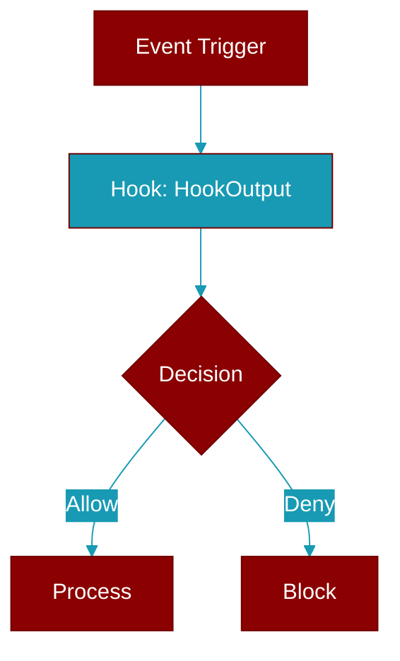

# HookOutput

> Defined in the [**types**](../modules/types) module.

<Badge color="blue">AI Agent</Badge>

Base hook output - common fields for all events.

## Properties

<ResponseField name="proceed" type="bool">
  No description available.
</ResponseField>

<ResponseField name="stop_reason" type="Optional">
  No description available.
</ResponseField>

<ResponseField name="suppress_output" type="bool">
  No description available.
</ResponseField>

<ResponseField name="system_message" type="Optional">
  No description available.
</ResponseField>

<ResponseField name="decision" type="HookDecision">
  No description available.
</ResponseField>

<ResponseField name="reason" type="Optional">
  No description available.
</ResponseField>

<ResponseField name="modified_data" type="Optional">
  No description available.
</ResponseField>

## Methods

<CardGroup cols={2}>
  <Card title="is_blocking()" icon="function" href="../functions/HookOutput-is_blocking">
    Check if this output represents a blocking decision.
  </Card>
  <Card title="should_stop()" icon="function" href="../functions/HookOutput-should_stop">
    Check if execution should stop.
  </Card>
  <Card title="get_reason()" icon="function" href="../functions/HookOutput-get_reason">
    Get the effective reason for blocking or stopping.
  </Card>
</CardGroup>

## Source

<Card title="View on GitHub" icon="github" href="https://github.com/MervinPraison/PraisonAI/blob/main/src/praisonai-agents/praisonaiagents/hooks/types.py#L100">
  `praisonaiagents/hooks/types.py` at line 100
</Card>

---

## Related Documentation

<CardGroup cols={2}>
  <Card title="Hooks Concept" icon="anchor" href="/docs/concepts/hooks" />
  <Card title="Hook Events" icon="bolt" href="/docs/features/hook-events" />
  <Card title="Callbacks" icon="phone" href="/docs/features/callbacks" />
  <Card title="Output Concept" icon="file-export" href="/docs/concepts/output" />
  <Card title="Output Configuration" icon="gear" href="/docs/configuration/output-config" />
</CardGroup>
