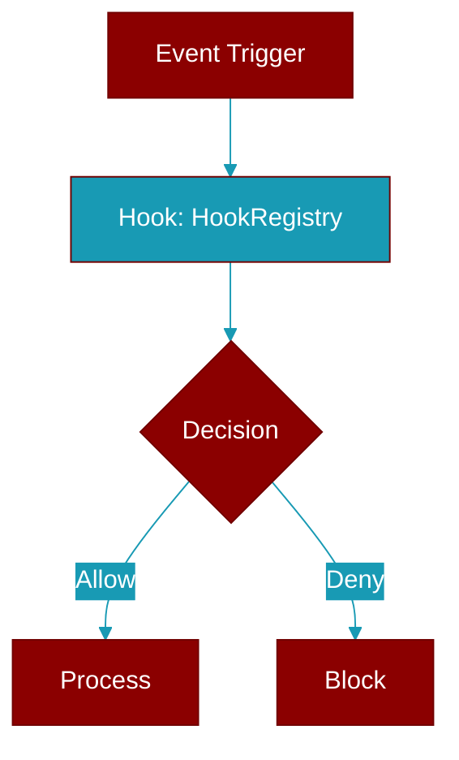

> Defined in the [**registry**](../modules/registry) module.

Registry for managing hooks.

Provides methods to register, unregister, and lookup hooks
for different events.



## Constructor

<ParamField query="enabled" type="bool" required={false} default="True">
  No description available.
</ParamField>

## Methods

<CardGroup cols={2}>
  <Card title="enabled()" icon="function" href="../functions/HookRegistry-enabled">
    Check if hooks are enabled.
  </Card>
  <Card title="enabled()" icon="function" href="../functions/HookRegistry-enabled">
    Enable or disable hooks.
  </Card>
  <Card title="register()" icon="function" href="../functions/HookRegistry-register">
    Register a hook definition.
  </Card>
  <Card title="register_function()" icon="function" href="../functions/HookRegistry-register_function">
    Register a Python function as a hook.
  </Card>
  <Card title="register_command()" icon="function" href="../functions/HookRegistry-register_command">
    Register a shell command as a hook.
  </Card>
  <Card title="on()" icon="function" href="../functions/HookRegistry-on">
    Decorator to register a function as a hook.
  </Card>
  <Card title="unregister()" icon="function" href="../functions/HookRegistry-unregister">
    Unregister a hook by ID.
  </Card>
  <Card title="get_hooks()" icon="function" href="../functions/HookRegistry-get_hooks">
    Get all hooks for an event, optionally filtered by target.
  </Card>
  <Card title="has_hooks()" icon="function" href="../functions/HookRegistry-has_hooks">
    Check if there are any hooks registered for an event.
  </Card>
  <Card title="clear()" icon="function" href="../functions/HookRegistry-clear">
    Clear all hooks or hooks for a specific event.
  </Card>
  <Card title="list_hooks()" icon="function" href="../functions/HookRegistry-list_hooks">
    List all registered hooks.
  </Card>
  <Card title="enable_hook()" icon="function" href="../functions/HookRegistry-enable_hook">
    Enable a specific hook.
  </Card>
  <Card title="disable_hook()" icon="function" href="../functions/HookRegistry-disable_hook">
    Disable a specific hook.
  </Card>
  <Card title="set_global_timeout()" icon="function" href="../functions/HookRegistry-set_global_timeout">
    Set the global timeout for all hooks.
  </Card>
</CardGroup>

## Usage

```python
registry = HookRegistry()
    
    # Register a function hook using decorator
    @registry.on(HookEvent.BEFORE_TOOL)
    def validate_tool(event_data):
        if event_data.tool_name == "dangerous":
            return HookResult.deny("Tool is dangerous")
        return HookResult.allow()
    
    # Register a command hook
    registry.register_command(
        event=HookEvent.BEFORE_TOOL,
        command="python /path/to/validator.py",
        matcher="write_*"
    )
```
