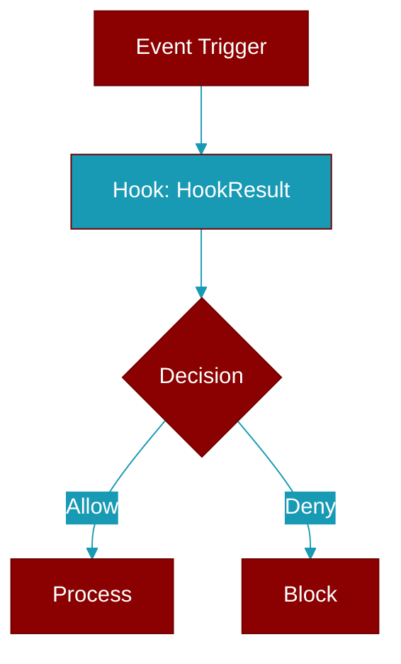

# HookResult

> Defined in the [**types**](../modules/types) module.

<Badge color="blue">AI Agent</Badge>

Result from a hook execution.

## Properties

<ResponseField name="decision" type="HookDecision">
  No description available.
</ResponseField>

<ResponseField name="reason" type="Optional">
  No description available.
</ResponseField>

<ResponseField name="modified_input" type="Optional">
  No description available.
</ResponseField>

<ResponseField name="additional_context" type="Optional">
  No description available.
</ResponseField>

<ResponseField name="suppress_output" type="bool">
  No description available.
</ResponseField>

## Methods

<CardGroup cols={2}>
  <Card title="allow()" icon="function" href="../functions/HookResult-allow">
    Create an allow result.
  </Card>
  <Card title="deny()" icon="function" href="../functions/HookResult-deny">
    Create a deny result.
  </Card>
  <Card title="block()" icon="function" href="../functions/HookResult-block">
    Create a block result.
  </Card>
  <Card title="ask()" icon="function" href="../functions/HookResult-ask">
    Create an ask result (requires user confirmation).
  </Card>
  <Card title="is_allowed()" icon="function" href="../functions/HookResult-is_allowed">
    Check if the result allows execution.
  </Card>
  <Card title="is_denied()" icon="function" href="../functions/HookResult-is_denied">
    Check if the result denies execution.
  </Card>
</CardGroup>
