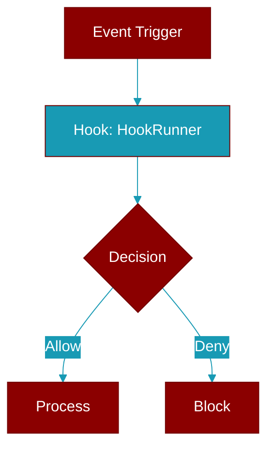

> Defined in the [**runner**](../modules/runner) module.

Executes hooks from a registry.

Supports:
- Python function hooks (sync and async)
- Shell command hooks
- Sequential and parallel execution
- Timeout handling
- Result aggregation



## Constructor

<ParamField query="registry" type="Optional" required={false}>
  No description available.
</ParamField>

<ParamField query="default_timeout" type="float" required={false} default="60.0">
  No description available.
</ParamField>

<ParamField query="cwd" type="Optional" required={false}>
  No description available.
</ParamField>

## Methods

<CardGroup cols={2}>
  <Card title="registry()" icon="function" href="../functions/HookRunner-registry">
    Get the hook registry.
  </Card>
  <Card title="execute()" icon="function" href="../functions/HookRunner-execute">
    Execute all hooks for an event.
  </Card>
  <Card title="execute_sync()" icon="function" href="../functions/HookRunner-execute_sync">
    Synchronous version of execute.
  </Card>
  <Card title="is_blocked()" icon="function" href="../functions/HookRunner-is_blocked">
    Check if any hook blocked execution.
  </Card>
  <Card title="get_blocking_reason()" icon="function" href="../functions/HookRunner-get_blocking_reason">
    Get the reason for blocking from results.
  </Card>
  <Card title="aggregate_context()" icon="function" href="../functions/HookRunner-aggregate_context">
    Aggregate additional context from all results.
  </Card>
</CardGroup>

## Usage

```python
registry = HookRegistry()
    runner = HookRunner(registry)
    
    # Execute hooks for an event
    results = await runner.execute(
        event=HookEvent.BEFORE_TOOL,
        input_data=BeforeToolInput(
            tool_name="write_file",
            tool_input={"path": "/tmp/test.txt"}
        )
    )
    
    # Check if any hook blocked
    if runner.is_blocked(results):
        print("Tool execution blocked by hook")
```
