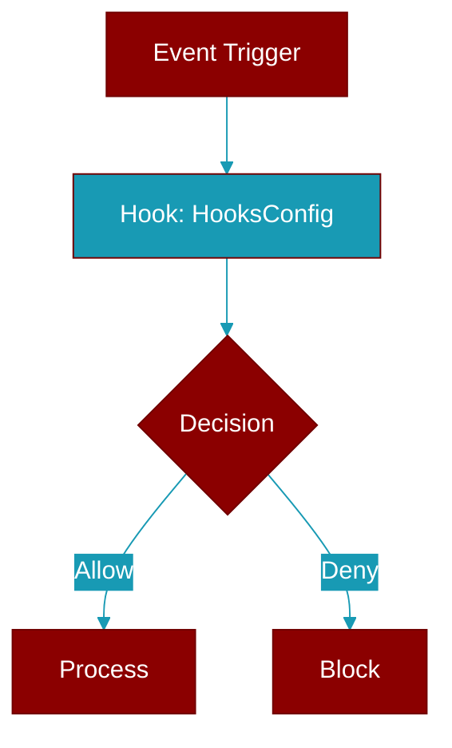

# HooksConfig

> Defined in the [**feature_configs**](../modules/feature_configs) module.

Configuration for agent hooks/callbacks.

Consolidates: hooks, step_callback



## Properties

<ResponseField name="on_step" type="Optional">
  No description available.
</ResponseField>

<ResponseField name="on_tool_call" type="Optional">
  No description available.
</ResponseField>

<ResponseField name="middleware" type="List">
  No description available.
</ResponseField>

<Accordion title="Internal & Generic Methods">
- **to_dict**: Convert to dictionary.
</Accordion>

## Usage

```python
Agent(hooks=HooksConfig(
        on_step=my_step_callback,
        on_tool_call=my_tool_callback,
        middleware=[my_middleware],
    ))
```
