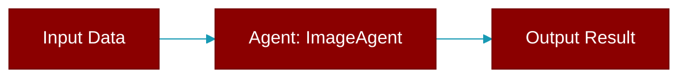

> Defined in the [**image_agent**](../modules/image_agent) module.

A specialized agent for generating images using AI models.

This agent extends the base Agent class with specific functionality for image generation,
including support for different models, sizes, and quality settings.

## Constructor

<ParamField query="name" type="Optional" required={false}>
  No description available.
</ParamField>

<ParamField query="role" type="Optional" required={false}>
  No description available.
</ParamField>

<ParamField query="goal" type="Optional" required={false}>
  No description available.
</ParamField>

<ParamField query="backstory" type="Optional" required={false}>
  No description available.
</ParamField>

<ParamField query="instructions" type="Optional" required={false}>
  No description available.
</ParamField>

<ParamField query="llm" type="Optional" required={false}>
  No description available.
</ParamField>

<ParamField query="style" type="str" required={false} default="'natural'">
  No description available.
</ParamField>

<ParamField query="response_format" type="str" required={false} default="'url'">
  No description available.
</ParamField>

<ParamField query="timeout" type="int" required={false} default="600">
  No description available.
</ParamField>

<ParamField query="api_base" type="Optional" required={false}>
  No description available.
</ParamField>

<ParamField query="api_key" type="Optional" required={false}>
  No description available.
</ParamField>

<ParamField query="api_version" type="Optional" required={false}>
  No description available.
</ParamField>

<ParamField query="verbose" type="Union" required={false} default="True">
  No description available.
</ParamField>

## Methods

<CardGroup cols={2}>
  <Card title="litellm()" icon="function" href="../functions/ImageAgent-litellm">
    Lazy load litellm module when needed.
  </Card>
  <Card title="generate_image()" icon="function" href="../functions/ImageAgent-generate_image">
    Generate an image based on the provided prompt.
  </Card>
  <Card title="agenerate_image()" icon="function" href="../functions/ImageAgent-agenerate_image">
    Async wrapper for generate_image.
  </Card>
  <Card title="generate()" icon="function" href="../functions/ImageAgent-generate">
    Alias for generate_image() - for consistency with VideoAgent/AudioAgent.
  </Card>
  <Card title="agenerate()" icon="function" href="../functions/ImageAgent-agenerate">
    Async alias for generate_image().
  </Card>
  <Card title="chat()" icon="function" href="../functions/ImageAgent-chat">
    Generate an image from the prompt.
  </Card>
  <Card title="achat()" icon="function" href="../functions/ImageAgent-achat">
    Async chat method for image generation.
  </Card>
  <Card title="edit()" icon="function" href="../functions/ImageAgent-edit">
    Edit an existing image with a prompt.
  </Card>
  <Card title="aedit()" icon="function" href="../functions/ImageAgent-aedit">
    Async version of edit().
  </Card>
  <Card title="variation()" icon="function" href="../functions/ImageAgent-variation">
    Generate variations of an existing image.
  </Card>
  <Card title="avariation()" icon="function" href="../functions/ImageAgent-avariation">
    Async version of variation().
  </Card>
</CardGroup>
