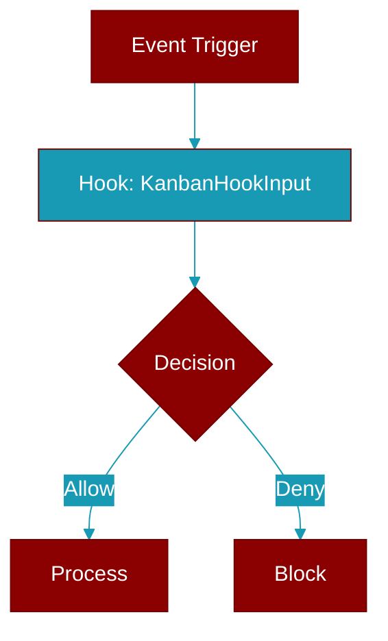

# KanbanHookInput

> Defined in the [**types**](../modules/types) module.

<Badge color="blue">AI Agent</Badge>

Hook input for kanban task lifecycle events.

Used by wrapper dispatcher and tools when emitting kanban events.
Observability adapters can subscribe to these via the hook registry.

## Properties

<ResponseField name="task_id" type="str">
  No description available.
</ResponseField>

<ResponseField name="board" type="str">
  No description available.
</ResponseField>

<ResponseField name="status" type="str">
  No description available.
</ResponseField>

<ResponseField name="assignee" type="Optional[str]">
  No description available.
</ResponseField>

<ResponseField name="from_status" type="Optional[str]">
  No description available.
</ResponseField>

<ResponseField name="to_status" type="Optional[str]">
  No description available.
</ResponseField>

<Accordion title="Internal & Generic Methods">
- **to_dict**: Convert to dictionary for JSON serialization.
</Accordion>

## Source

<Card title="View on GitHub" icon="github" href="https://github.com/MervinPraison/PraisonAI/blob/main/src/praisonai-agents/praisonaiagents/hooks/types.py#L136">
  `praisonaiagents/hooks/types.py` at line 136
</Card>

---

## Related Documentation

<CardGroup cols={2}>
  <Card title="Hooks Concept" icon="anchor" href="/docs/concepts/hooks" />
  <Card title="Hook Events" icon="bolt" href="/docs/features/hook-events" />
  <Card title="Callbacks" icon="phone" href="/docs/features/callbacks" />
</CardGroup>
