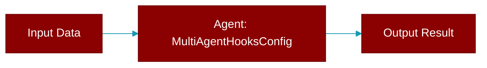

# MultiAgentHooksConfig

> Defined in the [**feature_configs**](../modules/feature_configs) module.

Configuration for multi-agent orchestration hooks/callbacks.

Consolidates: completion_checker, on_task_start, on_task_complete



## Properties

<ResponseField name="on_task_start" type="Optional">
  No description available.
</ResponseField>

<ResponseField name="on_task_complete" type="Optional">
  No description available.
</ResponseField>

<ResponseField name="completion_checker" type="Optional">
  No description available.
</ResponseField>

## Methods

<CardGroup cols={2}>
  <Card title="to_dict()" icon="function" href="../functions/MultiAgentHooksConfig-to_dict">
    Convert to dictionary.
  </Card>
</CardGroup>

## Usage

```python
Agents(
        agents=[...],
        hooks=MultiAgentHooksConfig(
            on_task_start=my_start_callback,
            on_task_complete=my_complete_callback,
            completion_checker=my_checker,
        )
    )
```
