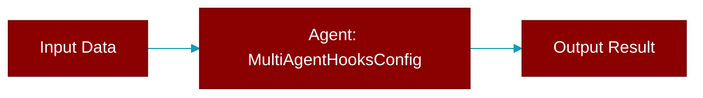

# MultiAgentHooksConfig

> Defined in the [**Feature Configs**](../modules/feature_configs) module.

<Badge color="blue">AI Agent</Badge>

Configuration for multi-agent orchestration hooks/callbacks.

Consolidates: completion_checker, on_task_start, on_task_complete


```mermaid
%%{init: {'theme': 'base', 'themeVariables': { 'primaryColor': '#8B0000', 'primaryTextColor': '#fff', 'primaryBorderColor': '#710101', 'lineColor': '#189AB4', 'secondaryColor': '#189AB4', 'tertiaryColor': '#fff' }}}%%

graph LR
    input["Input Data"] --> agent["Agent: MultiAgentHooksConfig"]
    agent --> output["Output Result"]
    style agent fill:#8B0000,color:#fff
    style input fill:#8B0000,color:#fff
    style output fill:#8B0000,color:#fff
```

## Properties

<ResponseField name="on_task_start" type="Optional[Callable[[Task, int], None]]">
  Called before each task starts. Signature: `(task, task_id)`. `task_id` is the integer assigned by AgentTeam to this task in the run.
</ResponseField>

<ResponseField name="on_task_complete" type="Optional[Callable[[Task, TaskOutput], None]]">
  Called after each task finishes. Signature: `(task, task_output)`. `task_output` is the `TaskOutput` produced by the agent for this task.
</ResponseField>

<ResponseField name="completion_checker" type="Optional[Callable]">
  Custom function to decide whether the team's run has finished. Overrides `AgentTeam.default_completion_checker`.
</ResponseField>

<Accordion title="Internal & Generic Methods">
- **to_dict**: Convert to dictionary.
</Accordion>

## Usage

```python
AgentManager(
        agents=[...],
        hooks=MultiAgentHooksConfig(
            on_task_start=my_start_callback,
            on_task_complete=my_complete_callback,
            completion_checker=my_checker,
        )
    )
```


## Source

<Card title="View on GitHub" icon="github" href="https://github.com/MervinPraison/PraisonAI/blob/main/src/praisonai-agents/praisonaiagents/config/feature_configs.py#L781">
  `praisonaiagents/config/feature_configs.py` at line 781
</Card>


---

## Related Documentation

<CardGroup cols={2}>
  <Card title="Agents Concept" icon="robot" href="/docs/concepts/agents" />
  <Card title="Single Agent Guide" icon="book-open" href="/docs/guides/single-agent" />
  <Card title="Multi-Agent Guide" icon="users" href="/docs/guides/multi-agent" />
  <Card title="Agent Configuration" icon="gear" href="/docs/configuration/agent-config" />
  <Card title="Auto Agents" icon="wand-magic-sparkles" href="/docs/features/autoagents" />
</CardGroup>
