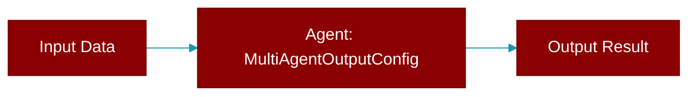

# MultiAgentOutputConfig

> Defined in the [**Feature Configs**](../modules/feature_configs) module.

<Badge color="blue">AI Agent</Badge>

Configuration for multi-agent output behavior.

Consolidates: verbose, stream



## Properties

<ResponseField name="verbose" type="int">
  No description available.
</ResponseField>

<ResponseField name="stream" type="bool">
  No description available.
</ResponseField>

<Accordion title="Internal & Generic Methods">
- **to_dict**: Convert to dictionary.
</Accordion>

## Usage

```python
# Simple preset
    AgentManager(agents=[...], output="verbose")
    
    # With config
    AgentManager(
        agents=[...],
        output=MultiAgentOutputConfig(verbose=2, stream=True)
    )
```


---

## Related Documentation

<CardGroup cols={2}>
  <Card title="Agents Concept" icon="robot" href="/docs/concepts/agents" />
  <Card title="Single Agent Guide" icon="book-open" href="/docs/guides/single-agent" />
  <Card title="Multi-Agent Guide" icon="users" href="/docs/guides/multi-agent" />
  <Card title="Agent Configuration" icon="gear" href="/docs/configuration/agent-config" />
  <Card title="Auto Agents" icon="wand-magic-sparkles" href="/docs/features/autoagents" />
</CardGroup>
