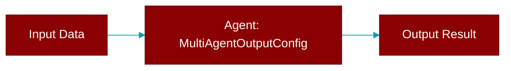

# MultiAgentOutputConfig

> Defined in the [**feature_configs**](../modules/feature_configs) module.

Configuration for multi-agent output behavior.

Consolidates: verbose, stream



## Properties

<ResponseField name="verbose" type="int">
  No description available.
</ResponseField>

<ResponseField name="stream" type="bool">
  No description available.
</ResponseField>

## Methods

<CardGroup cols={2}>
  <Card title="to_dict()" icon="function" href="../functions/MultiAgentOutputConfig-to_dict">
    Convert to dictionary.
  </Card>
</CardGroup>

## Usage

```python
# Simple preset
    Agents(agents=[...], output="verbose")
    
    # With config
    Agents(
        agents=[...],
        output=MultiAgentOutputConfig(verbose=2, stream=True)
    )
```
