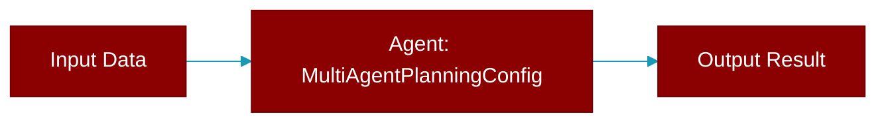

# MultiAgentPlanningConfig

> Defined in the [**Feature Configs**](../modules/feature_configs) module.

<Badge color="blue">AI Agent</Badge>

Configuration for multi-agent planning mode.

Consolidates: planning, planning_llm, auto_approve_plan, planning_tools, planning_reasoning



## Properties

<ResponseField name="llm" type="Optional">
  No description available.
</ResponseField>

<ResponseField name="auto_approve" type="bool">
  No description available.
</ResponseField>

<ResponseField name="tools" type="Optional">
  No description available.
</ResponseField>

<ResponseField name="reasoning" type="bool">
  No description available.
</ResponseField>

<Accordion title="Internal & Generic Methods">
- **to_dict**: Convert to dictionary.
</Accordion>

## Usage

```python
# Simple enable
    AgentManager(agents=[...], planning=True)
    
    # With config
    AgentManager(
        agents=[...],
        planning=MultiAgentPlanningConfig(
            llm="gpt-4o",
            auto_approve=True,
            reasoning=True,
        )
    )
```


## Source

<Card title="View on GitHub" icon="github" href="https://github.com/MervinPraison/PraisonAI/blob/main/src/praisonai-agents/praisonaiagents/config/feature_configs.py#L872">
  `praisonaiagents/config/feature_configs.py` at line 872
</Card>


---

## Related Documentation

<CardGroup cols={2}>
  <Card title="Agents Concept" icon="robot" href="/docs/concepts/agents" />
  <Card title="Single Agent Guide" icon="book-open" href="/docs/guides/single-agent" />
  <Card title="Multi-Agent Guide" icon="users" href="/docs/guides/multi-agent" />
  <Card title="Agent Configuration" icon="gear" href="/docs/configuration/agent-config" />
  <Card title="Auto Agents" icon="wand-magic-sparkles" href="/docs/features/autoagents" />
</CardGroup>
