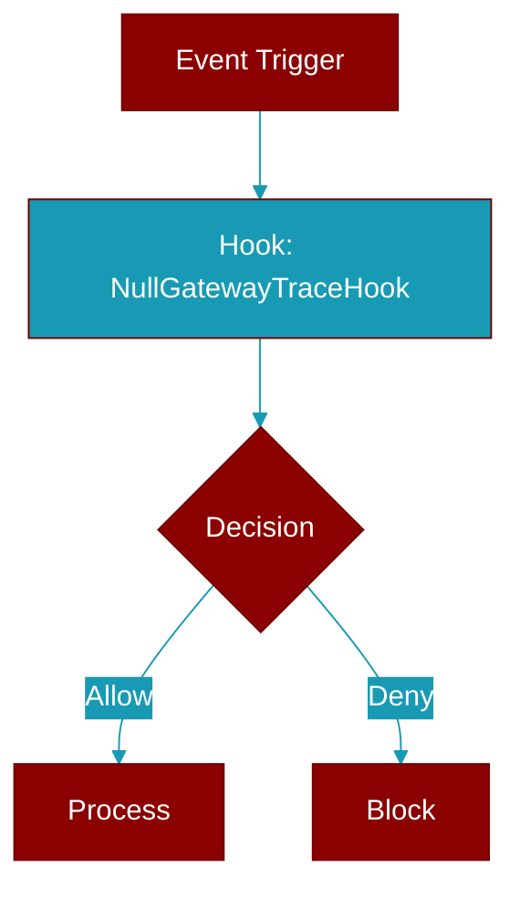

# NullGatewayTraceHook

> Defined in the [**protocols**](../modules/protocols) module.

<Badge color="blue">AI Agent</Badge>

Zero-cost no-op :class:`GatewayTraceHook` used when tracing is disabled.

Every stage call returns a lightweight, argument-ignoring null context
manager (one small allocation per call), so firing the seam adds negligible
overhead on the hot path. This is the default a gateway uses until an
exporter plugin (e.g. the OTel/OTLP plugin in ``praisonai-plugins``) is
supplied.

## Methods

<CardGroup cols={2}>
  <Card title="stage()" icon="function" href="../functions/NullGatewayTraceHook-stage">
    Return a no-op context manager, ignoring all arguments.
  </Card>
</CardGroup>

## Source

<Card title="View on GitHub" icon="github" href="https://github.com/MervinPraison/PraisonAI/blob/main/src/praisonai-agents/praisonaiagents/gateway/protocols.py#L4866">
  `praisonaiagents/gateway/protocols.py` at line 4866
</Card>

---

## Related Documentation

<CardGroup cols={2}>
  <Card title="Hooks Concept" icon="anchor" href="/docs/concepts/hooks" />
  <Card title="Hook Events" icon="bolt" href="/docs/features/hook-events" />
  <Card title="Callbacks" icon="phone" href="/docs/features/callbacks" />
  <Card title="Gateway Feature" icon="tower-broadcast" href="/docs/features/gateway" />
</CardGroup>
