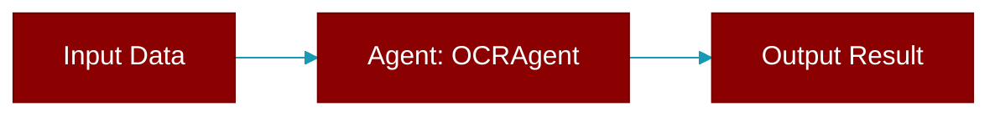

> Defined in the [**ocr_agent**](../modules/ocr_agent) module.

A specialized agent for OCR (Optical Character Recognition).

Extracts text from documents (PDFs) and images using AI models.

Supported Providers:
    - Mistral: `mistral/mistral-ocr-latest`



## Constructor

<ParamField query="name" type="Optional" required={false}>
  No description available.
</ParamField>

<ParamField query="instructions" type="Optional" required={false}>
  No description available.
</ParamField>

<ParamField query="llm" type="Optional" required={false}>
  No description available.
</ParamField>

<ParamField query="model" type="Optional" required={false}>
  No description available.
</ParamField>

<ParamField query="base_url" type="Optional" required={false}>
  No description available.
</ParamField>

<ParamField query="api_key" type="Optional" required={false}>
  No description available.
</ParamField>

<ParamField query="ocr" type="Optional" required={false}>
  No description available.
</ParamField>

<ParamField query="verbose" type="Union" required={false} default="True">
  No description available.
</ParamField>

## Methods

<CardGroup cols={2}>
  <Card title="console()" icon="function" href="../functions/OCRAgent-console">
    Lazily initialize Rich Console.
  </Card>
  <Card title="litellm()" icon="function" href="../functions/OCRAgent-litellm">
    Lazy load litellm module when needed.
  </Card>
  <Card title="extract()" icon="function" href="../functions/OCRAgent-extract">
    Extract text from a document or image.
  </Card>
  <Card title="aextract()" icon="function" href="../functions/OCRAgent-aextract">
    Async version of extract().
  </Card>
  <Card title="read()" icon="function" href="../functions/OCRAgent-read">
    Quick OCR - extract and return markdown text.
  </Card>
  <Card title="aread()" icon="function" href="../functions/OCRAgent-aread">
    Async version of read().
  </Card>
</CardGroup>

## Usage

```python
from praisonaiagents import OCRAgent
    
    agent = OCRAgent(llm="mistral/mistral-ocr-latest")
    
    # Extract from PDF URL
    result = agent.extract("https://example.com/document.pdf")
    print(result.text)
    
    # Extract from image URL
    result = agent.extract("https://example.com/image.png")
    for page in result.pages:
        print(page.markdown)
```
