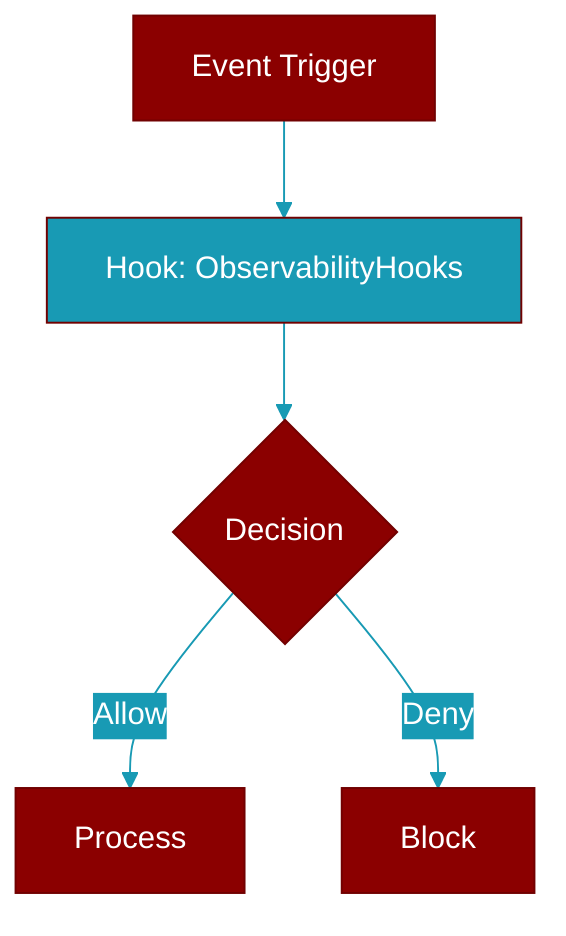

# ObservabilityHooks

> Defined in the [**observability**](../modules/observability) module.

<Badge color="blue">AI Agent</Badge>

Observability hooks for escalation pipeline.

Provides:
- Event emission
- Metrics collection
- Custom handler registration
- Tracing support



## Constructor

<ParamField query="enabled" type="bool" required={false} default="True">
  No description available.
</ParamField>

## Methods

<CardGroup cols={2}>
  <Card title="on()" icon="function" href="../functions/ObservabilityHooks-on">
    Register an event handler.
  </Card>
  <Card title="off()" icon="function" href="../functions/ObservabilityHooks-off">
    Unregister an event handler.
  </Card>
  <Card title="emit()" icon="function" href="../functions/ObservabilityHooks-emit">
    Emit an event.
  </Card>
  <Card title="set_session()" icon="function" href="../functions/ObservabilityHooks-set_session">
    Set current session ID.
  </Card>
  <Card title="set_stage()" icon="function" href="../functions/ObservabilityHooks-set_stage">
    Set current stage.
  </Card>
  <Card title="increment_step()" icon="function" href="../functions/ObservabilityHooks-increment_step">
    Increment step counter.
  </Card>
  <Card title="add_tokens()" icon="function" href="../functions/ObservabilityHooks-add_tokens">
    Add to token count.
  </Card>
  <Card title="get_events()" icon="function" href="../functions/ObservabilityHooks-get_events">
    Get all recorded events.
  </Card>
  <Card title="get_metrics()" icon="function" href="../functions/ObservabilityHooks-get_metrics">
    Get collected metrics.
  </Card>
  <Card title="reset()" icon="function" href="../functions/ObservabilityHooks-reset">
    Reset all state.
  </Card>
  <Card title="start_execution()" icon="function" href="../functions/ObservabilityHooks-start_execution">
    Mark execution start.
  </Card>
  <Card title="end_execution()" icon="function" href="../functions/ObservabilityHooks-end_execution">
    Mark execution end.
  </Card>
  <Card title="get_summary()" icon="function" href="../functions/ObservabilityHooks-get_summary">
    Get execution summary.
  </Card>
</CardGroup>

## Usage

```python
hooks = ObservabilityHooks()
    
    # Register handler
    hooks.on(EventType.STAGE_ESCALATE, lambda e: print(f"Escalated to {e.stage}"))
    
    # Use with pipeline
    pipeline = EscalationPipeline(observability=hooks)
```


## Source

<Card title="View on GitHub" icon="github" href="https://github.com/MervinPraison/PraisonAI/blob/main/src/praisonai-agents/praisonaiagents/escalation/observability.py#L116">
  `praisonaiagents/escalation/observability.py` at line 116
</Card>


---

## Related Documentation

<CardGroup cols={2}>
  <Card title="Hooks Concept" icon="anchor" href="/docs/concepts/hooks" />
  <Card title="Hook Events" icon="bolt" href="/docs/features/hook-events" />
  <Card title="Callbacks" icon="phone" href="/docs/features/callbacks" />
</CardGroup>
