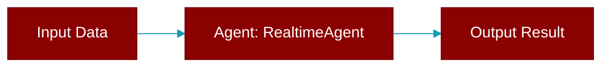

> Defined in the [**realtime_agent**](../modules/realtime_agent) module.

Agent for real-time voice conversations using OpenAI Realtime API.

This agent enables bidirectional audio streaming for voice conversations,
supporting both text and audio modalities with configurable voice settings.



## Constructor

<ParamField query="name" type="str" required={false} default="'RealtimeAgent'">
  No description available.
</ParamField>

<ParamField query="llm" type="Optional" required={false}>
  No description available.
</ParamField>

<ParamField query="realtime" type="Optional" required={false}>
  No description available.
</ParamField>

<ParamField query="instructions" type="Optional" required={false}>
  No description available.
</ParamField>

<ParamField query="verbose" type="bool" required={false} default="True">
  No description available.
</ParamField>

## Methods

<CardGroup cols={2}>
  <Card title="console()" icon="function" href="../functions/RealtimeAgent-console">
    Lazy load Rich console.
  </Card>
  <Card title="connect()" icon="function" href="../functions/RealtimeAgent-connect">
    Connect to the Realtime API (sync wrapper).
  </Card>
  <Card title="aconnect()" icon="function" href="../functions/RealtimeAgent-aconnect">
    Connect to the Realtime API asynchronously.
  </Card>
  <Card title="disconnect()" icon="function" href="../functions/RealtimeAgent-disconnect">
    Disconnect from the Realtime API (sync wrapper).
  </Card>
  <Card title="adisconnect()" icon="function" href="../functions/RealtimeAgent-adisconnect">
    Disconnect from the Realtime API asynchronously.
  </Card>
  <Card title="send_text()" icon="function" href="../functions/RealtimeAgent-send_text">
    Send text message (sync wrapper).
  </Card>
  <Card title="asend_text()" icon="function" href="../functions/RealtimeAgent-asend_text">
    Send text message asynchronously.
  </Card>
  <Card title="send_audio()" icon="function" href="../functions/RealtimeAgent-send_audio">
    Send audio data (sync wrapper).
  </Card>
  <Card title="asend_audio()" icon="function" href="../functions/RealtimeAgent-asend_audio">
    Send audio data asynchronously.
  </Card>
  <Card title="on_message()" icon="function" href="../functions/RealtimeAgent-on_message">
    Register callback for text messages.
  </Card>
  <Card title="on_audio()" icon="function" href="../functions/RealtimeAgent-on_audio">
    Register callback for audio data.
  </Card>
  <Card title="on_error()" icon="function" href="../functions/RealtimeAgent-on_error">
    Register callback for errors.
  </Card>
  <Card title="receive_loop()" icon="function" href="../functions/RealtimeAgent-receive_loop">
    Main receive loop for processing incoming events.
  </Card>
</CardGroup>

## Usage

```python
from praisonaiagents import RealtimeAgent
    
    agent = RealtimeAgent(
        name="VoiceAssistant",
        realtime={"voice": "nova"}
    )
    
    # Connect and start conversation
    await agent.aconnect()
    await agent.send_text("Hello!")
```
