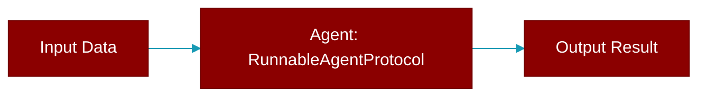

# RunnableAgentProtocol

> Defined in the [**protocols**](../modules/protocols) module.

<Badge color="blue">AI Agent</Badge>

Extended Protocol for agents that support run/start methods.

This extends AgentProtocol with the run/start interface used
by the Agent class for task execution.

## Methods

<CardGroup cols={2}>
  <Card title="run()" icon="function" href="../functions/RunnableAgentProtocol-run">
    Run the agent with a prompt (alias for chat in most cases).
  </Card>
  <Card title="start()" icon="function" href="../functions/RunnableAgentProtocol-start">
    Start the agent with a prompt.
  </Card>
  <Card title="arun()" icon="function" href="../functions/RunnableAgentProtocol-arun">
    Async run the agent with a prompt.
  </Card>
  <Card title="astart()" icon="function" href="../functions/RunnableAgentProtocol-astart">
    Async start the agent with a prompt.
  </Card>
</CardGroup>

## Source

<Card title="View on GitHub" icon="github" href="https://github.com/MervinPraison/PraisonAI/blob/main/src/praisonai-agents/praisonaiagents/agent/protocols.py#L95">
  `praisonaiagents/agent/protocols.py` at line 95
</Card>

---

## Related Documentation

<CardGroup cols={2}>
  <Card title="Agents Concept" icon="robot" href="/docs/concepts/agents" />
  <Card title="Single Agent Guide" icon="book-open" href="/docs/guides/single-agent" />
  <Card title="Multi-Agent Guide" icon="users" href="/docs/guides/multi-agent" />
  <Card title="Agent Configuration" icon="gear" href="/docs/configuration/agent-config" />
  <Card title="Auto Agents" icon="wand-magic-sparkles" href="/docs/features/autoagents" />
</CardGroup>
