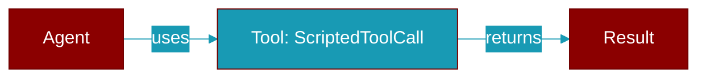

# ScriptedToolCall

> Defined in the [**scripted**](../modules/scripted) module.

<Badge color="blue">AI Agent</Badge>

One tool call the double should emit.

Attributes:
    name: Tool function name, matching a tool given to the agent.
    arguments: Arguments dict; serialised to JSON exactly as a provider would.
    id: Optional tool-call id. Generated when omitted.

## Properties

<ResponseField name="name" type="str">
  No description available.
</ResponseField>

<ResponseField name="arguments" type="Dict[str, Any]">
  No description available.
</ResponseField>

<ResponseField name="id" type="Optional[str]">
  No description available.
</ResponseField>

## Source

<Card title="View on GitHub" icon="github" href="https://github.com/MervinPraison/PraisonAI/blob/main/src/praisonai-agents/praisonaiagents/model_harness/scripted.py#L98">
  `praisonaiagents/model_harness/scripted.py` at line 98
</Card>

---

## Related Documentation

<CardGroup cols={2}>
  <Card title="Tools Concept" icon="wrench" href="/docs/concepts/tools" />
  <Card title="Create Custom Tools" icon="plus" href="/docs/guides/tools/create-custom-tools" />
  <Card title="Tool Development" icon="code" href="/docs/tutorials/advanced-tool-development" />
</CardGroup>
