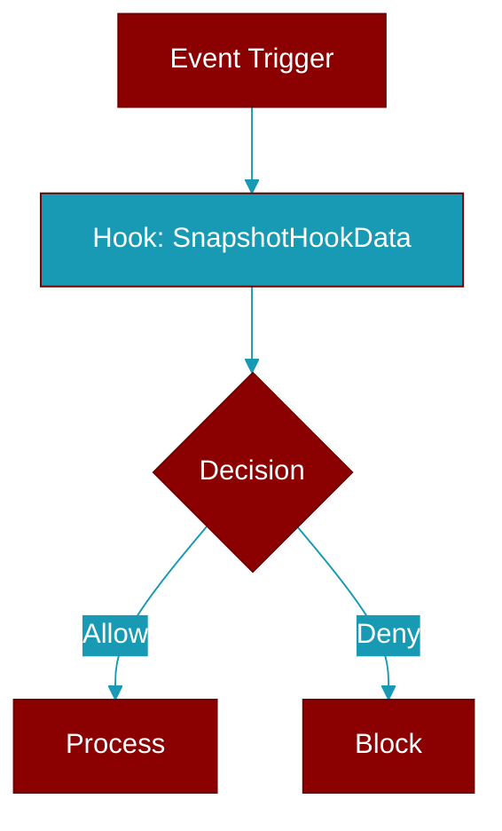

# SnapshotHookData

> Defined in the [**manager**](../modules/manager) module.

Data captured at LLM call boundary for exact snapshot.

## Properties

<ResponseField name="timestamp" type="str">
  No description available.
</ResponseField>

<ResponseField name="messages" type="List">
  No description available.
</ResponseField>

<ResponseField name="tools" type="List">
  No description available.
</ResponseField>

<ResponseField name="message_hash" type="str">
  No description available.
</ResponseField>

<ResponseField name="tools_hash" type="str">
  No description available.
</ResponseField>

<ResponseField name="ledger" type="Optional">
  No description available.
</ResponseField>

<ResponseField name="budget" type="Optional">
  No description available.
</ResponseField>

## Methods

<CardGroup cols={2}>
  <Card title="to_dict()" icon="function" href="../functions/SnapshotHookData-to_dict">
    Instance method.
  </Card>
</CardGroup>
