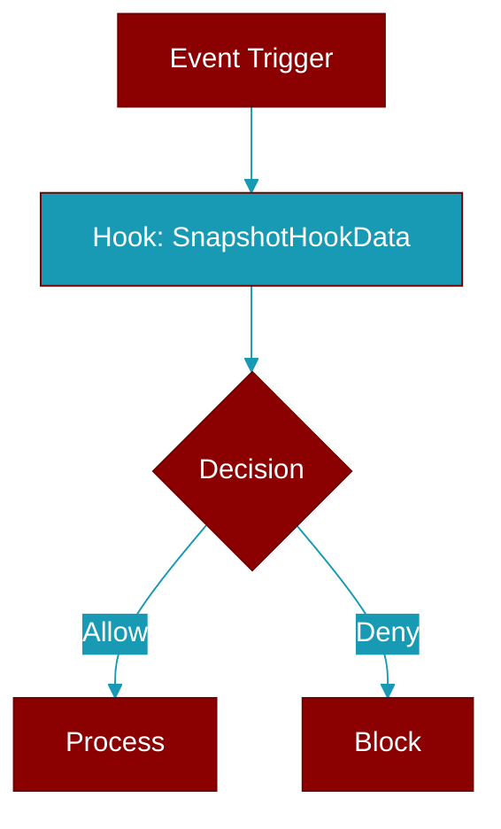

# SnapshotHookData

> Defined in the [**manager**](../modules/manager) module.

<Badge color="blue">AI Agent</Badge>

Data captured at LLM call boundary for exact snapshot.

## Properties

<ResponseField name="timestamp" type="str">
  No description available.
</ResponseField>

<ResponseField name="messages" type="List">
  No description available.
</ResponseField>

<ResponseField name="tools" type="List">
  No description available.
</ResponseField>

<ResponseField name="message_hash" type="str">
  No description available.
</ResponseField>

<ResponseField name="tools_hash" type="str">
  No description available.
</ResponseField>

<ResponseField name="ledger" type="Optional">
  No description available.
</ResponseField>

<ResponseField name="budget" type="Optional">
  No description available.
</ResponseField>

<Accordion title="Internal & Generic Methods">
- **to_dict**: Generic utility method.
</Accordion>

## Source

<Card title="View on GitHub" icon="github" href="https://github.com/MervinPraison/PraisonAI/blob/main/src/praisonai-agents/praisonaiagents/context/manager.py#L271">
  `praisonaiagents/context/manager.py` at line 271
</Card>

---

## Related Documentation

<CardGroup cols={2}>
  <Card title="Hooks Concept" icon="anchor" href="/docs/concepts/hooks" />
  <Card title="Hook Events" icon="bolt" href="/docs/features/hook-events" />
  <Card title="Callbacks" icon="phone" href="/docs/features/callbacks" />
</CardGroup>
