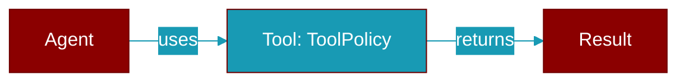

# ToolPolicy

> Defined in the [**protocols**](../modules/protocols) module.

<Badge color="blue">AI Agent</Badge>

Declarative, per-route scope applied to an agent's tool surface.

Mirrors the scheduler's ``RunPolicy.filter_tools`` contract (wrapper layer)
but lives in core so :class:`RouteBinding` can *declare* the scope without
importing any heavy wrapper code.  The wrapper inbound path applies it via a
small apply/restore helper, exactly as the scheduler already does for
unattended runs.

Attributes:
    allow_tools: If set, only tools whose name is in this set are kept;
        everything else is removed.  ``None`` means "allow all except
        ``deny_tools`` / the trust deny-list".
    deny_tools: Exact tool names removed before the run.
    deny_substrings: Case-insensitive substrings; a tool whose name
        contains any of them is removed (used by the ``untrusted`` tier).

## Properties

<ResponseField name="allow_tools" type="Optional">
  No description available.
</ResponseField>

<ResponseField name="deny_tools" type="Set[str]">
  No description available.
</ResponseField>

<ResponseField name="deny_substrings" type="List[str]">
  No description available.
</ResponseField>

## Methods

<CardGroup cols={2}>
  <Card title="is_noop()" icon="function" href="../functions/ToolPolicy-is_noop">
    ``True`` when the policy would never remove any tool.
  </Card>
  <Card title="is_tool_allowed()" icon="function" href="../functions/ToolPolicy-is_tool_allowed">
    Return ``True`` if ``tool`` may be exposed on this route.
  </Card>
  <Card title="filter_tools()" icon="function" href="../functions/ToolPolicy-filter_tools">
    Return a copy of ``tools`` with denied/disallowed tools removed.
  </Card>
</CardGroup>

## Source

<Card title="View on GitHub" icon="github" href="https://github.com/MervinPraison/PraisonAI/blob/main/src/praisonai-agents/praisonaiagents/gateway/protocols.py#L1598">
  `praisonaiagents/gateway/protocols.py` at line 1598
</Card>

---

## Related Documentation

<CardGroup cols={2}>
  <Card title="Tools Concept" icon="wrench" href="/docs/concepts/tools" />
  <Card title="Create Custom Tools" icon="plus" href="/docs/guides/tools/create-custom-tools" />
  <Card title="Tool Development" icon="code" href="/docs/tutorials/advanced-tool-development" />
</CardGroup>
