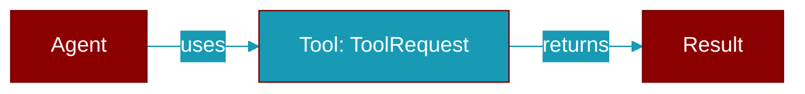

# ToolRequest

> Defined in the [**middleware**](../modules/middleware) module.

<Badge color="blue">AI Agent</Badge>

Request data for tool calls.

## Properties

<ResponseField name="tool_name" type="str">
  No description available.
</ResponseField>

<ResponseField name="arguments" type="Dict">
  No description available.
</ResponseField>

<ResponseField name="context" type="Optional">
  No description available.
</ResponseField>

<ResponseField name="extra" type="Dict">
  No description available.
</ResponseField>
