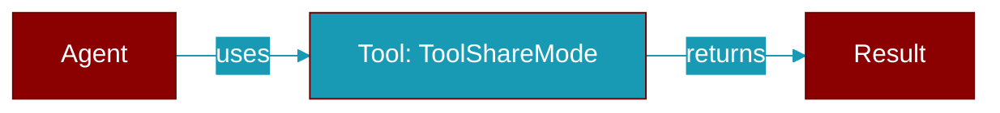

# ToolShareMode

> Defined in the [**manager**](../modules/manager) module.

How tools are shared between agents.

```mermaid
%%{init: {'theme': 'base', 'themeVariables': { 'primaryColor': '#8B0000', 'primaryTextColor': '#fff', 'primaryBorderColor': '#710101', 'lineColor': '#189AB4', 'secondaryColor': '#189AB4', 'tertiaryColor': '#fff' }}}%%

graph LR
    agent["Agent"] -- "uses" --> tool["Tool: ToolShareMode"]
    tool -- "returns" --> result["Result"]
    style tool fill:#189AB4,color:#fff
    style agent fill:#8B0000,color:#fff
    style result fill:#8B0000,color:#fff
```
